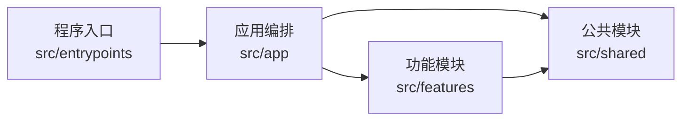
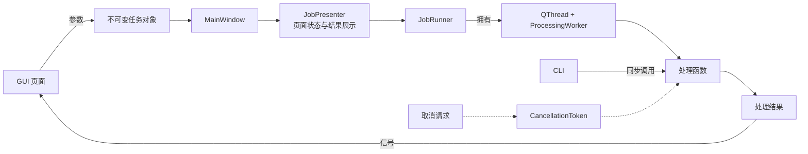
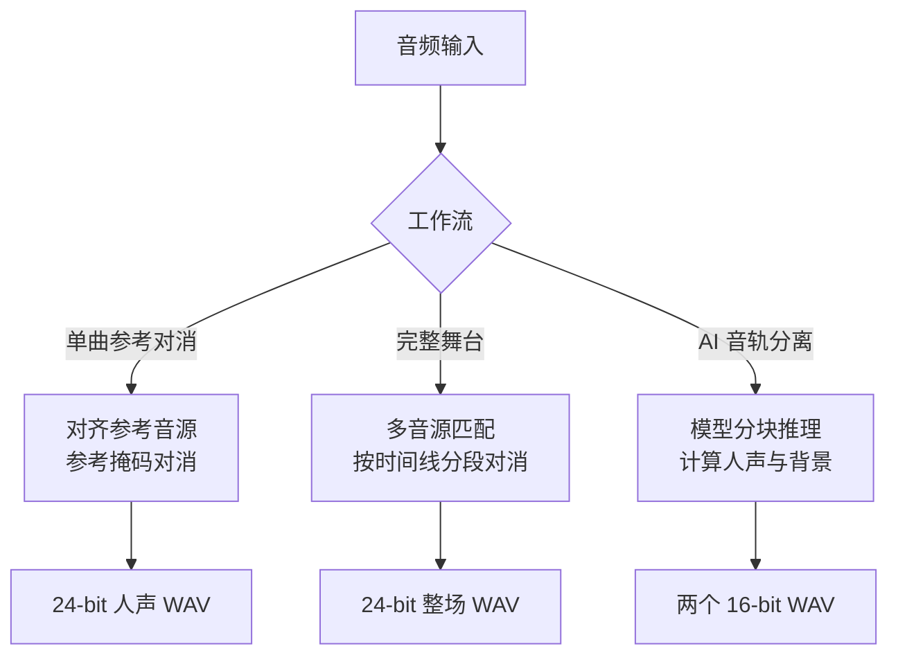

# 架构与数据流

<p align="left">
  <strong>简体中文</strong> · <a href="en/architecture.md">English</a>
</p>

## 设计目标

Audio Station 将界面、功能实现和公共基础设施分开。GUI 与 CLI 只负责收集参数、报告进度和展示结果，实际处理由可独立调用的任务函数完成。这样可以让桌面端和命令行复用同一实现，也便于在不启动界面的情况下测试音频管线。

## 分层结构

```text
src/entrypoints/                 程序入口，只负责启动 GUI 或解析 CLI
src/app/                         主窗口、任务运行器和跨功能编排
src/features/                    各功能自包含的页面、模型与处理逻辑
├── reference_removal/           单曲参考对消、试听控件与 DSP
├── full_stage/                  完整舞台分析与时间线模型
├── neural_separation/           MDX-Net 模型、模型仓库与推理
├── home/                        首页
└── settings/                    设置页
src/shared/                      音频、频谱、配置、日志、任务协议和通用控件
src/resources/                   翻译和模型规格等只读资源
```

依赖方向为：



`tests/test_architecture.py` 通过抽象语法树检查以下边界：

- `shared` 不得导入 `app`、`entrypoints` 或任何 `features`。
- 功能包不得导入 `app`、`entrypoints` 或其他功能包。
- `app` 不得反向导入 `entrypoints`。
- 需要联合多个功能的逻辑放在 `app`。例如完整舞台渲染同时使用时间线分析与参考对消，因此位于 `src/app/full_stage_processing.py`。

公共数据模型按“由谁消费”归属，而不是按最早出现的位置归属。例如 `AudioStats` 同时用于单曲和完整舞台，定义在
`shared.audio`；`ReferenceJob` 只服务单曲参考对消，保留在 `features/reference_removal`。功能模块之间不通过
重导出公共类型建立隐式依赖。

## 任务执行模型

每个页面只发出开始和取消信号，不直接控制线程。`MainWindow` 根据页面参数建立不可变任务对象，并把处理函数交给
`JobPresenter`。协调器负责页面 running 状态、进度提示与结果展示，并把后台执行交给 `JobRunner`。运行器独占
`QThread` 和 `ProcessingWorker` 的生命周期，保证同一窗口一次只有一个任务；`ProcessingWorker` 只负责把普通
Python 调用适配为 Qt 信号。运行器只在线程对象完成 deferred delete 后发出自己的 `finished`，避免窗口关闭或测试
作用域退出与 Qt 对象析构竞态。主窗口因此只保留导航、任务参数构造和关闭协调。



CLI 创建相同的任务数据类并同步调用同一处理函数。`SIGINT` 会设置 `CancellationToken`；各个解码、重采样、分析、推理和写出循环定期调用 `raise_if_cancelled()`，因此取消是协作式的。

## 音频数据与内存管理

公共音频类型 `AudioData` 使用 `[声道, 帧]` 排列的 `float32` 平面数据。长音频不常驻普通 NumPy 数组，而是写入临时
`np.memmap`：

- 解码、统计和多数复制操作以 262,144 帧为一块。
- libsndfile 无法读取的格式回退到 Qt Multimedia 解码。
- 重采样使用 soxr 的高质量流式接口。
- 单声道输入会扩展为双声道；多于两个声道时处理前取前两个声道。
- 临时音频通过 `cleanup()` 关闭并删除；长循环可调用 `release_pages()` 释放已处理映射页。

`shared.audio.analysis` 提供分块复制、峰值/RMS 统计和跨工作流共用的 `AudioStats`。这些操作使用相同的
262,144 帧块大小并响应取消，避免每条管线各自维护一套容易漂移的实现。

WAV 写出先生成同目录临时文件，成功后使用 `os.replace` 原子替换目标。取消或异常不会留下半写入的正式输出。

## 三条处理管线



### 单曲参考对消

```text
读取两段音频 → 双声道化 → 参考重采样 → 可选时间对齐
→ 参考对消 → 统计 → 原子写出
```

输出长度取待处理音频与对齐后参考音频的共同长度，并写出 24-bit WAV。

### 完整舞台

```text
整场与音源提取指纹 → 独立匹配 → 生成和人工校正时间线
→ 复制整场原音 → 对匹配片段逐段对齐并对消 → 淡入淡出拼接 → 原子写出
```

未匹配区间来自整场原音的副本，因此不会因识别失败而补零或缩短。

### AI 音轨分离

```text
读取并双声道化 → 重采样到 44.1 kHz → 查找或下载模型
→ MDX-Net 分块推理 → 背景 = 混音 - 人声 → 写出两个 16-bit WAV
```

## 配置、翻译与日志

- 配置由 QFluentWidgets 的 `QConfig` 持久化。
- 翻译文件位于 `src/resources/i18n/`，采用扁平键；中文、英文、日文、韩文的键集合必须完全一致。
- 日志使用单行格式 `日期 时间 [级别] 模块: 消息`，Qt 与 FFmpeg 消息也会进入统一日志系统。
- GUI 切换语言时，各页面通过 `retranslate()` 更新控件文本和下拉列表。
- 各处理管线通过 `shared.progress.report_progress()` 统一翻译并生成 `ProgressEvent`，避免每个功能重复拼装进度协议。

## 错误边界

输入文件相同、输出覆盖输入、参数范围错误等可预期问题使用 `ValueError`、`KeyError` 或
`FileNotFoundError`。CLI 对这些错误返回状态码 2，未预期异常返回 1，取消返回 130；GUI 则通过工作线程信号显示错误提示。

时间对齐失败是少数允许降级的情况：处理管线记录警告并使用原始时间线继续运行。取消异常不得被吞掉。
