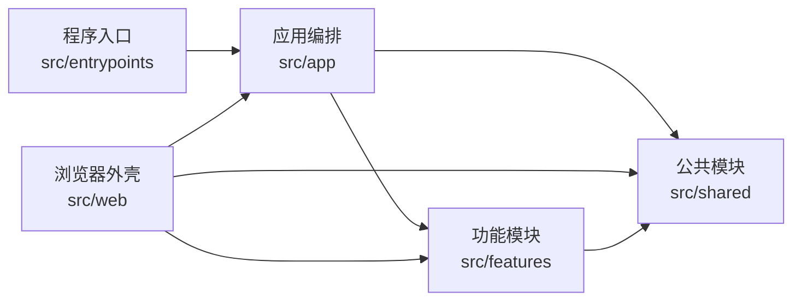
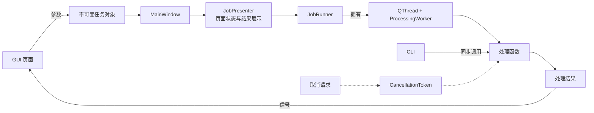
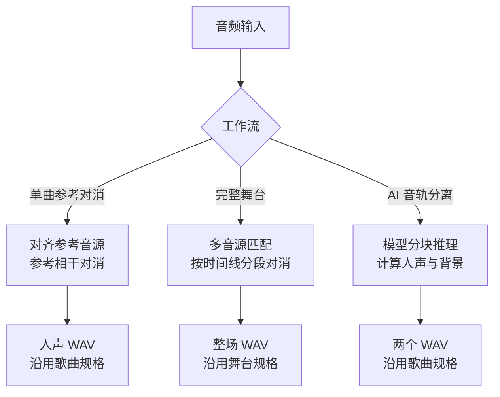
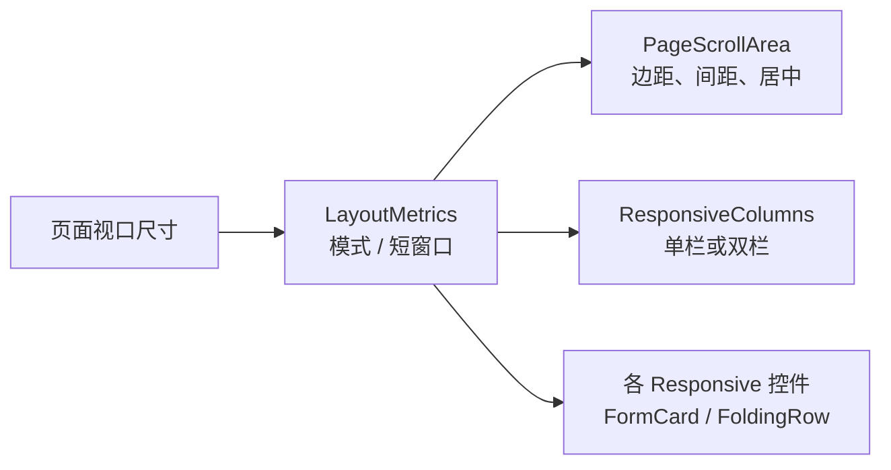

# 架构与数据流

<p align="left">
  <strong>简体中文</strong> · <a href="en/architecture.md">English</a>
</p>

## 设计目标

Purivox 把界面、功能实现和公共基础设施分开。GUI 和 CLI 只负责收集参数、报告进度和展示结果，
实际处理由可独立调用的任务函数完成。这样桌面端和命令行可以共用同一套实现，
也便于在不启动界面的情况下测试音频处理流程。

## 分层结构

```text
src/entrypoints/                 程序入口，只负责启动 GUI 或解析 CLI
src/app/                         主窗口、任务运行器和跨功能编排
src/features/                    各功能自包含的页面、模型与处理逻辑
├── reference_removal/           单曲参考对消、试听控件与 DSP
├── full_stage/                  完整舞台分析与时间线模型
├── neural_separation/           MDX-Net 模型、模型仓库与推理
├── home/                        首页
└── settings/                    设置页
src/shared/                      音频、频谱、任务参数校验、配置、日志、任务协议和通用控件
src/web/                         浏览器外壳，Pyodide 里的作业入口与内存预算
src/resources/                   翻译和模型规格等只读资源
```

依赖方向为：



`src/app` 和 `src/web` 是同一层的两种外壳：前者编排 GUI，后者编排浏览器里的
Pyodide 作业，两者都可以自由使用 `features` 和 `shared`，都不得反向导入 `entrypoints`。
浏览器版的完整说明见[浏览器版（WebAssembly）](web.md)。

`tests/test_architecture.py` 通过抽象语法树检查以下边界：

- `shared` 不得导入 `app`、`entrypoints` 或任何 `features`。
- 功能包不得导入 `app`、`entrypoints` 或其他功能包。
- `app` 和 `web` 都不得反向导入 `entrypoints`。
- 需要联合多个功能的逻辑放在 `app`。例如完整舞台渲染同时使用时间线分析与参考对消，因此位于
  `src/app/full_stage_processing.py`。

公共数据模型按使用方归属，而不是按最先出现的位置归属。例如 `AudioStats` 同时用于单曲和完整舞台，
定义在 `shared.audio`；`ReferenceJob` 只服务单曲参考对消，保留在 `features/reference_removal`。
功能模块之间不通过再导出公共类型建立隐式依赖。

同一条规则适用于代码：被多个功能重复实现的取值和算法统一放到 `shared`，而不是在功能之间互相导入。
单曲与完整舞台任务共用 `shared.jobs.validate_reference_settings()` 校验强度与统计窗口；
两者的起音特征共用 `shared.dsp.log_flux_bands()`；文件对话框过滤器与自动查找的扩展名共用
`shared.audio.AUDIO_EXTENSIONS`。

## 任务执行模型

每个页面只发出开始和取消信号，不直接控制线程。`MainWindow` 根据页面参数建立不可变任务对象，并把
处理函数交给 `JobPresenter`。协调器负责页面的运行状态、进度提示与结果展示，并把后台执行交给
`JobRunner`。运行器独占 `QThread` 和 `ProcessingWorker` 的生命周期，保证同一窗口一次只有一个
任务；`ProcessingWorker` 只负责把普通 Python 调用适配为 Qt 信号。运行器只在线程对象完成
deferred delete 之后发出自己的 `finished`，避免窗口关闭或测试作用域退出时与 Qt 对象析构产生竞态。
因此主窗口只需要负责导航、任务参数构造和关闭协调。



CLI 创建相同的任务数据类并同步调用同一处理函数。`SIGINT` 会设置 `CancellationToken`；
解码、重采样、分析、推理和写出等循环都会定期调用 `raise_if_cancelled()`，因此取消是协作式的。

## 音频数据与内存管理

公共音频类型 `AudioData` 使用 `[声道, 帧]` 排列的 `float32` 平面数据。长音频不常驻普通 NumPy 数组，
而是写入临时 `np.memmap`：

- 解码、统计、重采样、写出和多数复制操作以 262,144 帧为一块（`shared.audio.BLOCK_FRAMES`）。
- libsndfile 无法读取的格式回退到 Qt Multimedia 解码。
- 重采样使用 soxr 的高质量流式接口。
- 单声道输入会扩展为双声道；多于两个声道时，处理前取前两个声道。
- 临时音频通过 `cleanup()` 关闭并删除；长循环可调用 `release_pages()` 释放已处理的映射页。

`shared.audio.analysis` 提供分块复制、峰值/RMS 统计和跨工作流共用的 `AudioStats`。块大小只在
`shared.audio.BLOCK_FRAMES` 定义一次，由所有流式循环共用，避免每条管线各自维护一套容易漂移的实现。
映射页的查找与释放同样只有 `shared.audio.release_mapped_pages()` 一份实现，`AudioData` 与参考对消的
分块循环都调用它。

WAV 写出先生成同目录临时文件，成功后使用 `os.replace` 原子替换目标文件。取消或异常不会留下
写了一半的正式输出。

## 三条处理管线



### 单曲参考对消

```text
读取两段音频 → 双声道化 → 参考重采样 → 可选时间对齐
→ 参考对消 → 统计 → 原子写出
```

输出长度始终跟随待处理音频；歌曲音源较短时，其结束后的区域按静音参考处理并保留原音，不再截短结果。
结果按歌曲自身的采样率与位深写出，不再有导出规格下限。

### 完整舞台

```text
整场与音源提取指纹 → 独立匹配 → 生成和人工校正时间线
→ 复制整场原音 → 对匹配片段逐段对齐并对消 → 淡入淡出拼接 → 原子写出
```

未匹配区间来自整场原音的副本，因此不会因识别失败而补零或缩短。
整场内部处理与最终导出都保持舞台 / 现场音频自身的采样率与位深。

### AI 音轨分离

```text
读取并双声道化 → 重采样到 44.1 kHz → 查找或下载模型
→ MDX-Net 分块推理 → 背景 = 混音 - 人声
→ 重采样回歌曲原采样率 → 写出两个 WAV
```

导出文件沿用输入文件的采样率与位深：模型推理固定在 44.1 kHz，把结果升采样到更高规格只会让文件变大，
不会产生输入或模型里没有的频谱细节，因此不再这样做。位深方面，8-bit 与 16-bit PCM 输入按 16-bit 写出，
更宽的 24/32-bit PCM、浮点以及所有有损格式按 24-bit 写出。

## 响应式布局

窗口形状由 `src/shared/ui/responsive.py` 归纳成四种模式，判定依据只有页面实际可用的宽度：

| 模式 | 页面宽度 | 布局 |
|---|---|---|
| `PORTRAIT` 竖屏 | < 620 | 单栏；标签移到控件上方，音量条独占一行 |
| `HALF` 半屏 | < 960 | 单栏；标签与控件同行，边距收紧 |
| `LANDSCAPE` 横屏 | < 1440 | 单栏；完整边距 |
| `ULTRAWIDE` 超宽屏 | >= 1440 | 双栏；内容列最宽 1760 px，超出部分居中留白 |

只按宽度分档：竖屏显示器上一个 800 px 宽的窗口虽然是竖的，却仍放得下标签与控件同行，
因此按半屏而不是按手机宽度排版。高度只影响纵向留白与列表 / 时间线的最小高度
（`LayoutMetrics.short`）。

页面不监听自己子控件的尺寸，而是由 `PageScrollArea` 测量视口后自上而下分发：



这样控件是因为“页面窄”才折叠，而不是因为它已经被挤扁——后者会在滚动区域关闭横向滚动条时
把页面直接切掉。同理，状态标签与模型下拉框调用 `shared.ui.allow_shrinking()`：
一条包含长路径的完成消息没有可换行的空格，若不放开宽度约束就会把整页撑宽。

卡片通过 `PageScrollArea.add_card()` 声明自己属于主栏还是次栏。单栏时按添加顺序排列，
双栏时才分开，因此窄窗口自上而下的阅读顺序与宽窗口左右并排的一致：
单曲页把文件与参数放在主栏，状态、试听与音频信息放在次栏。

## 配置、翻译与日志

- 配置由 QFluentWidgets 的 `QConfig` 持久化。
- 翻译使用 Qt 原生体系：`src/resources/i18n/*.ts`（Qt Linguist XML）经 `pyside6-lrelease` 编译成
  `*.qm`，由 `QTranslator` 加载并安装到 `QCoreApplication`。键按标识符组织，四种语言的键集合
  必须完全一致。
- `shared.i18n.tr(key, **values)` 通过 `QCoreApplication.translate()` 取当前安装语言的文本，再填充
  `{name}` 占位符；未知键返回键名本身。语言是应用级状态，任务对象不再携带语言字段。
- 日志使用单行格式 `日期 时间 [级别] 模块: 消息`，Qt 与 FFmpeg 消息也会进入统一日志系统。
- GUI 切换语言时，各页面通过 `retranslate()` 更新控件文本和下拉列表。
- 各处理管线通过 `shared.progress.report_progress()` 统一翻译并生成 `ProgressEvent`，
  避免每个功能重复拼装进度协议。

## 错误边界

输入文件相同、输出覆盖输入、参数范围错误等可预期问题使用 `ValueError`、`KeyError` 或
`FileNotFoundError`。CLI 对这些错误返回状态码 2，未预期异常返回 1，取消返回 130；GUI 则通过
工作线程信号显示错误提示。

时间对齐失败是少数允许降级的情况：处理管线记录警告并使用原始时间线继续运行。取消异常不得被忽略。
