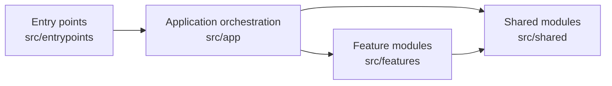
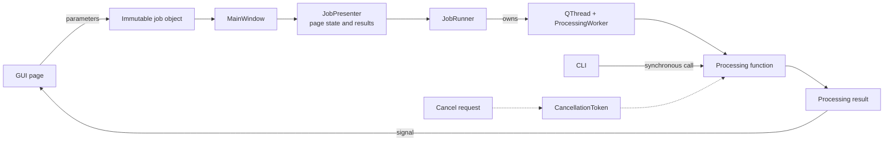
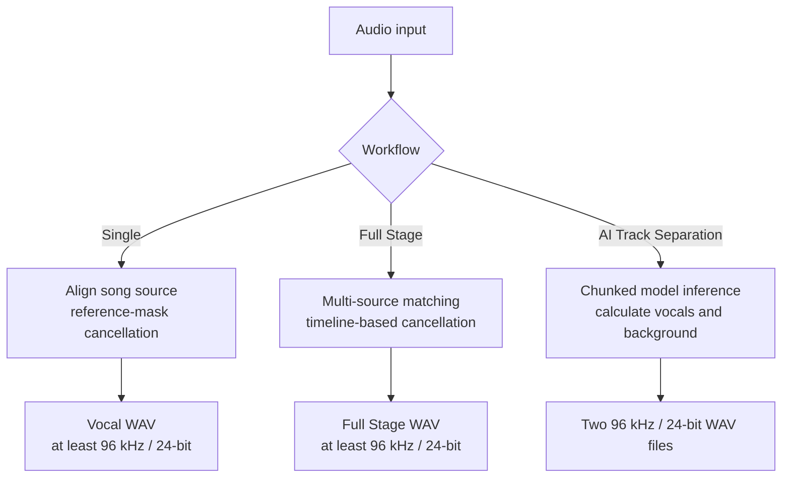

# Architecture and Data Flow

<p align="left">
  <a href="../architecture.md">简体中文</a> · <strong>English</strong>
</p>

## Design Goals

Audio Station separates its interface, feature implementations, and shared infrastructure. The
GUI and CLI only collect parameters, report progress, and present results; independently callable
task functions perform the actual processing. This lets the desktop application and command line
reuse the same implementation and makes it possible to test audio pipelines without starting the
interface.

## Layered Structure

```text
src/entrypoints/                 Startup only: launches the GUI or parses the CLI
src/app/                         Main window, task runner, and cross-feature orchestration
src/features/                    Self-contained pages, models, and processing logic
├── reference_removal/           Single-track reference cancellation, preview controls, and DSP
├── full_stage/                  Full Stage analysis and timeline models
├── neural_separation/           MDX-Net models, model store, and inference
├── home/                        Home page
└── settings/                    Settings page
src/shared/                      Audio, spectra, configuration, logging, task protocol, and widgets
src/resources/                   Read-only resources such as translations and model specifications
```

Dependencies flow in one direction:



`tests/test_architecture.py` uses the abstract syntax tree to enforce these boundaries:

- `shared` must not import `app`, `entrypoints`, or any `features` package.
- Feature packages must not import `app`, `entrypoints`, or another feature package.
- `app` must not import `entrypoints`.
- Logic that combines multiple features belongs in `app`. Full Stage rendering, for example, uses
  both timeline analysis and reference cancellation, so it lives in
  `src/app/full_stage_processing.py`.

A shared data model belongs to the layer that consumes it, not necessarily where it first
appeared. `AudioStats`, for example, is used by both Single and Full Stage and is defined in
`shared.audio`; `ReferenceJob` serves only single-track reference cancellation and remains in
`features/reference_removal`. Feature modules must not create implicit dependencies by
re-exporting shared types from one another.

## Task Execution Model

Each page emits start and cancel signals without controlling threads directly. `MainWindow`
creates an immutable job object from the page parameters and passes the processing function to
`JobPresenter`. The presenter manages the page's running state, progress text, and result display,
then delegates background execution to `JobRunner`. The runner exclusively owns the lifecycle of
the `QThread` and `ProcessingWorker`, ensuring that only one task runs in a window at a time.
`ProcessingWorker` only adapts a regular Python call to Qt signals. The runner emits its own
`finished` signal only after the thread object completes deferred deletion, preventing races
between Qt object destruction and window closure or test-scope teardown. This leaves the main
window responsible only for navigation, job construction, and coordinated shutdown.



The CLI constructs the same job data classes and calls the same processing functions
synchronously. `SIGINT` sets a `CancellationToken`; decoding, resampling, analysis, inference, and
output loops call `raise_if_cancelled()` periodically, so cancellation is cooperative.

## Audio Data and Memory Management

The shared `AudioData` type stores planar `float32` data in `[channel, frame]` order. Long audio is
written to temporary `np.memmap` storage instead of remaining in ordinary NumPy arrays:

- Decoding, analysis, and most copy operations use blocks of 262,144 frames.
- Formats that libsndfile cannot read fall back to Qt Multimedia decoding.
- Resampling uses soxr's high-quality streaming interface.
- Mono input is expanded to stereo; inputs with more than two channels use the first two channels
  before processing.
- Temporary audio is closed and deleted through `cleanup()`; long loops can call
  `release_pages()` to release processed mapped pages.

`shared.audio.analysis` provides chunked copying, peak/RMS analysis, and the `AudioStats` model
shared across workflows. These operations use the same 262,144-frame block size and respond to
cancellation, avoiding separate implementations that could drift between pipelines.

WAV output is first written to a temporary file in the destination directory, then atomically
replaces the destination with `os.replace`. Cancellation or failure therefore does not leave a
partially written final output.

## Three Processing Pipelines



### Single

```text
Read both files → convert to stereo → resample the song source → optional time alignment
→ reference cancellation → analysis → atomic output
```

The output length is the duration shared by the input audio and aligned song source. A result below
96 kHz is upsampled to 96 kHz before being written as a 24-bit WAV; a higher original sample rate
is preserved.

### Full Stage

```text
Extract fingerprints from the full recording and sources → match independently
→ generate and manually correct a timeline → copy the original full recording
→ align and cancel each matched segment → blend boundaries → atomic output
```

Unmatched ranges come from the copy of the original full recording, so failed identification does
not introduce silence or shorten the output.
Internal Full Stage processing retains the stage/live audio sample rate, while final output also
uses PCM WAV at 96 kHz / 24-bit or higher.

### AI Track Separation

```text
Read and convert to stereo → resample to 44.1 kHz → find or download the model
→ chunked MDX-Net inference → background = mix - vocals
→ upsample to 96 kHz → write two 24-bit WAV files
```

Here, Hi-Res describes the output file's sample rate and bit depth. It does not mean that a
low-rate input or 44.1 kHz model inference gains new high-frequency information, and it is not a
claim of Hi-Res Audio Logo certification.

## Configuration, Translation, and Logging

- QFluentWidgets `QConfig` persists application configuration.
- Translation files are stored in `src/resources/i18n/` with flat keys. Chinese, English,
  Japanese, and Korean must have identical key sets.
- Logs use the single-line format `date time [level] module: message`; Qt and FFmpeg messages also
  enter the unified logging system.
- When the GUI language changes, each page updates its widget text and combo boxes through
  `retranslate()`.
- Every processing pipeline uses `shared.progress.report_progress()` to translate and create
  `ProgressEvent` objects, avoiding duplicate progress protocols in each feature.

## Error Boundaries

Expected problems such as identical input files, an output overwriting an input, or invalid
parameters use `ValueError`, `KeyError`, or `FileNotFoundError`. The CLI returns status 2 for these
errors, 1 for unexpected failures, and 130 for cancellation; the GUI displays errors through
worker-thread signals.

Alignment failure is one of the few allowed fallbacks: the pipeline logs a warning and continues
using the original timeline. Cancellation exceptions must never be swallowed.
