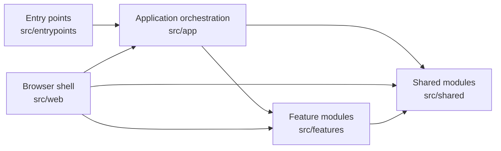
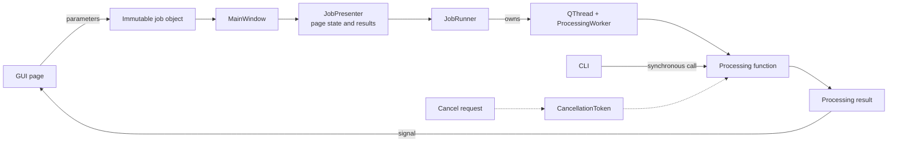
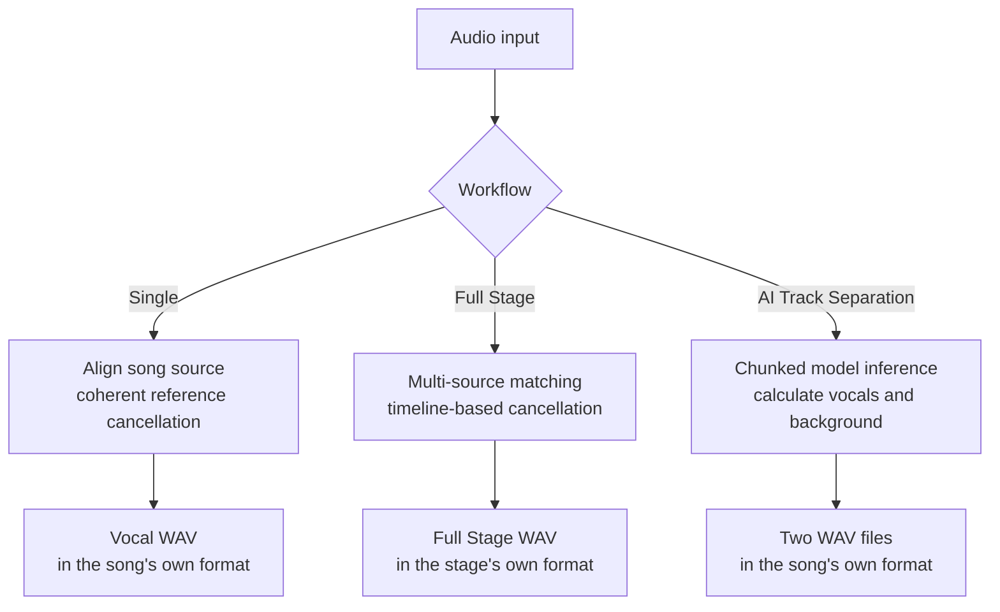
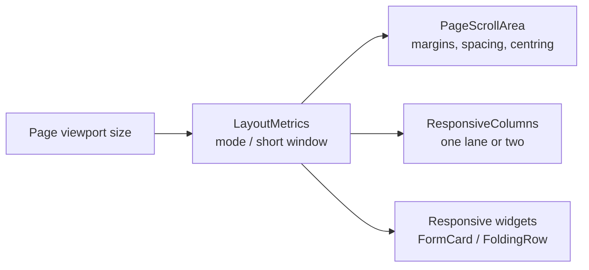

# Architecture and Data Flow

<p align="left">
  <a href="../architecture.md">简体中文</a> · <strong>English</strong>
</p>

## Design Goals

Purivox separates its interface, feature implementations, and shared infrastructure. The
GUI and CLI only collect parameters, report progress, and present results; the actual processing
happens in independently callable task functions. This lets the desktop application and command
line reuse the same implementation and makes it possible to test audio pipelines without starting
the interface.

## Layered Structure

```text
src/entrypoints/                 Startup only: launches the GUI or parses the CLI
src/app/                         Main window, task runner, and cross-feature orchestration
src/features/                    Self-contained pages, models, and processing logic
├── reference_removal/           Single-track reference cancellation, preview controls, and DSP
├── full_stage/                  Full Stage analysis and timeline models
├── neural_separation/           MDX-Net models, model store, and inference
├── home/                        Home page
└── settings/                    Settings page and the release check
src/shared/                      Audio, spectra, job validation, configuration, logging,
                                 task protocol, and widgets
src/web/                         Browser shell: the job entry points and memory budget under Pyodide
src/resources/                   Read-only resources such as translations and model specifications
```

Dependencies flow in one direction:



`src/app` and `src/web` are two shells at the same level: the first orchestrates the GUI, the
second the Pyodide jobs that run in a browser. Both may use `features` and `shared` freely, and
neither may import `entrypoints`. The browser build is described in full in
[Browser Build (WebAssembly)](web.md).

`tests/test_architecture.py` uses the abstract syntax tree to enforce these boundaries:

- `shared` must not import `app`, `entrypoints`, or any `features` package.
- Feature packages must not import `app`, `entrypoints`, or another feature package.
- Neither `app` nor `web` may import `entrypoints`.
- Logic that combines multiple features belongs in `app`. Full Stage rendering, for example, uses
  both timeline analysis and reference cancellation, so it lives in
  `src/app/full_stage_processing.py`.

A shared data model belongs to the layer that consumes it, not necessarily where it first
appeared. `AudioStats`, for example, is used by both Single and Full Stage and is defined in
`shared.audio`; `ReferenceJob` serves only single-track reference cancellation and remains in
`features/reference_removal`. Feature modules must not create implicit dependencies by
re-exporting shared types from one another.

The same rule applies to code: values and algorithms that more than one feature would otherwise
reimplement move down into `shared` rather than being imported across features. Single-track and
full-stage jobs validate strength and the statistics window through
`shared.jobs.validate_reference_settings()`; both derive onset features from
`shared.dsp.log_flux_bands()`; the file-dialog filters and the automatic accompaniment finder share
`shared.audio.AUDIO_EXTENSIONS`.

## Task Execution Model

Each page emits start and cancel signals without controlling threads directly. `MainWindow`
creates an immutable job object from the page parameters and passes the processing function to
`JobPresenter`. The presenter manages the page's running state, progress text, and result display,
then delegates background execution to `JobRunner`. The runner has exclusive ownership of the
`QThread` and `ProcessingWorker` lifecycles, ensuring that only one task runs in a window at a
time.
`ProcessingWorker` only adapts a regular Python call to Qt signals. The runner emits its own
`finished` signal only after the thread object completes deferred deletion, preventing races
between Qt object destruction and window closure or test-scope teardown. This leaves the main
window responsible only for navigation, job construction, and coordinated shutdown.



The CLI constructs the same job data classes and calls the same processing functions
synchronously. `SIGINT` sets a `CancellationToken`; decoding, resampling, analysis, inference, and
output loops call `raise_if_cancelled()` periodically, so cancellation is cooperative.

## Audio Data and Memory Management

The shared `AudioData` type stores planar `float32` data in `[channel, frame]` order. Long audio is
written to temporary `np.memmap` storage instead of remaining in ordinary NumPy arrays:

- Decoding, analysis, resampling, writing, and most copy operations use blocks of 262,144
  frames (`shared.audio.BLOCK_FRAMES`).
- Formats that libsndfile cannot read fall back to Qt Multimedia decoding.
- Resampling uses soxr's high-quality streaming interface.
- Mono input is expanded to stereo; inputs with more than two channels use the first two channels
  before processing.
- Temporary audio is closed and deleted through `cleanup()`; long loops can call
  `release_pages()` to release processed mapped pages.
- Only platforms with a real disk under them map at all. The browser build runs on Emscripten,
  whose filesystem is itself in memory, so mapping there would cost a second copy and
  `create_pcm_audio` allocates on the heap instead; see [the browser build](web.md).

`shared.audio.analysis` provides chunked copying, peak/RMS analysis, and the `AudioStats` model
shared across workflows. The block size is defined once as `shared.audio.BLOCK_FRAMES` and reused by
every streaming loop; finding and releasing mapped pages likewise has a single implementation,
`shared.audio.release_mapped_pages()`, called by both `AudioData` and the reference-cancellation
block loop. All of these operations respond to cancellation, avoiding separate implementations that
could drift between pipelines.

WAV output is first written to a temporary file in the destination directory, and `os.replace`
then atomically replaces the destination. Cancellation or failure therefore leaves no partially
written final output.

## Three Processing Pipelines



### Single

```text
Read both files → convert to stereo → resample the song source → optional time alignment
→ reference cancellation → analysis → atomic output
```

The output always retains the complete input-audio duration. If the song source is shorter, its
remaining region is treated as a silent reference and the original input tail is preserved. The
result is written at the song's own sample rate and bit depth; there is no export floor.

### Full Stage

```text
Extract fingerprints from the full recording and sources → match independently
→ generate and manually correct a timeline → copy the original full recording
→ align and cancel each matched segment → blend boundaries → atomic output
```

Unmatched ranges come from the copy of the original full recording, so failed identification does
not introduce silence or shorten the output.
Internal Full Stage processing and the final export both retain the stage/live audio's own sample
rate and bit depth.

### AI Track Separation

```text
Read and convert to stereo → resample to 44.1 kHz → find or download the model
→ chunked MDX-Net inference → background = mix — vocals
→ resample back to the song's own rate → write two WAV files
```

An export matches the file it came from. Model inference is fixed at 44.1 kHz, so upsampling the
result to a higher export format would only enlarge the file without producing spectral detail
absent from the input or the model, and the pipeline no longer does it. For bit depth, an 8- or
16-bit PCM input is written at 16 bits, and wider 24-/32-bit PCM, float and every lossy format are
written at 24.

## Responsive Layout

`src/shared/ui/responsive.py` reduces the window shape to four modes, decided by the width a page
actually has to spend:

| Mode | Page width | Layout |
|---|---|---|
| `PORTRAIT` | < 620 | One column; labels move above their controls, volume takes its own line |
| `HALF` | < 960 | One column; labels beside their controls, tighter margins |
| `LANDSCAPE` | < 1440 | One column; full margins |
| `ULTRAWIDE` | >= 1440 | Two lanes; the content column stops at 1760 px and is centred |

Width alone decides the mode: a 800 px window on a portrait screen is portrait-shaped but still has
room for a label beside its control, so it lays out like a half screen rather than like a phone.
Height only affects vertical breathing space and the minimum height of the source list and the
timeline (`LayoutMetrics.short`).

A page never watches its own children. `PageScrollArea` measures its viewport and hands the metrics
down:



A control therefore folds because the *page* is narrow, not because it has already been squeezed —
the latter would simply cut the page off, since the scroll areas keep their horizontal scroll bar
switched off. For the same reason status labels and the model combo call
`shared.ui.allow_shrinking()`: a completion message carrying a long path has no space to wrap at and
would otherwise widen the whole page.

Cards declare their lane through `PageScrollArea.add_card()`. One column keeps the order they were
added in and only two lanes split them apart, so a narrow window reads top to bottom in the same
order a wide one reads side by side: the single-song page keeps files and parameters in the primary
lane, and status, preview and audio data in the secondary one.

## Configuration, Translation, and Logging

- QFluentWidgets `QConfig` persists application configuration.
- Translation uses the native Qt system: `src/resources/i18n/*.ts` (Qt Linguist XML) is compiled by
  `pyside6-lrelease` into `*.qm`, which `QTranslator` loads and installs into `QCoreApplication`.
  Catalogues are keyed by identifier, and all four languages must have identical key sets.
- `shared.i18n.tr(key, **values)` resolves through `QCoreApplication.translate()` against the
  installed language and then fills `{name}` placeholders; an unknown key returns the key itself.
  Language is application state, so job objects no longer carry a language field.
- Logs use the single-line format `date time [level] module: message`; Qt and FFmpeg messages also
  enter the unified logging system.
- On the desktop every run also appends to `log_directory()/YYYY-MM-DD.log` (a `logs/` directory
  under the application data location) alongside stderr, so the runs of one day share one file and
  files older than `LOG_RETENTION_DAYS` are removed at startup. The browser build has nowhere to
  write, which is why file logging is asked for by the entry points rather than being the default.
- When the GUI language changes, each page updates its widget text and combo boxes through
  `retranslate()`.
- Every processing pipeline uses `shared.progress.report_progress()` to translate and create
  `ProgressEvent` objects, avoiding duplicate progress protocols in each feature.

## Error Boundaries

Expected problems such as identical input files, an output overwriting an input, or invalid
parameters use `ValueError`, `KeyError`, or `FileNotFoundError`. The CLI returns status 2 for these
errors, 1 for unexpected failures, and 130 for cancellation; the GUI displays errors through
worker-thread signals.

Alignment failure is one of the few allowed fallbacks: the pipeline logs a warning and continues
using the original timeline. Cancellation exceptions must never be swallowed.

An exception nobody caught reaches `app/crash_handler.py`. PySide6 prints an uncaught exception and
lets the event loop carry on, so this is a report rather than a shutdown: the traceback goes into
that day's log at CRITICAL, the file opens in whatever the desktop reads text with, and a dialog
points the user at the issue form. That URL carries the version, the platform, the build and the
exception's type - not its message, which is the part most likely to be a path. The log stays out
of it: it holds absolute paths, a URL is in the browser's history before anyone has read it, GitHub
answers an over-long one with 414 rather than a shortened form, and a day's log is over the budget
once percent-encoded. It goes on the clipboard instead, written only once the user has chosen to
report, and the reporter pastes it into the form's code block themselves and sees what they are
sending. That field does not use the schema's `render:`: a prefilled rendered text area cannot be
edited, and the field arrives prefilled from its own `value:`, so the `<details>` and the code
fence are spelled out in the template. One run raises one dialog - an exception thrown from `paintEvent` repeats on every
frame. A native crash or
a `qFatal` never gets here, but the Qt message handler has already put what Qt said about it in the
same file.
