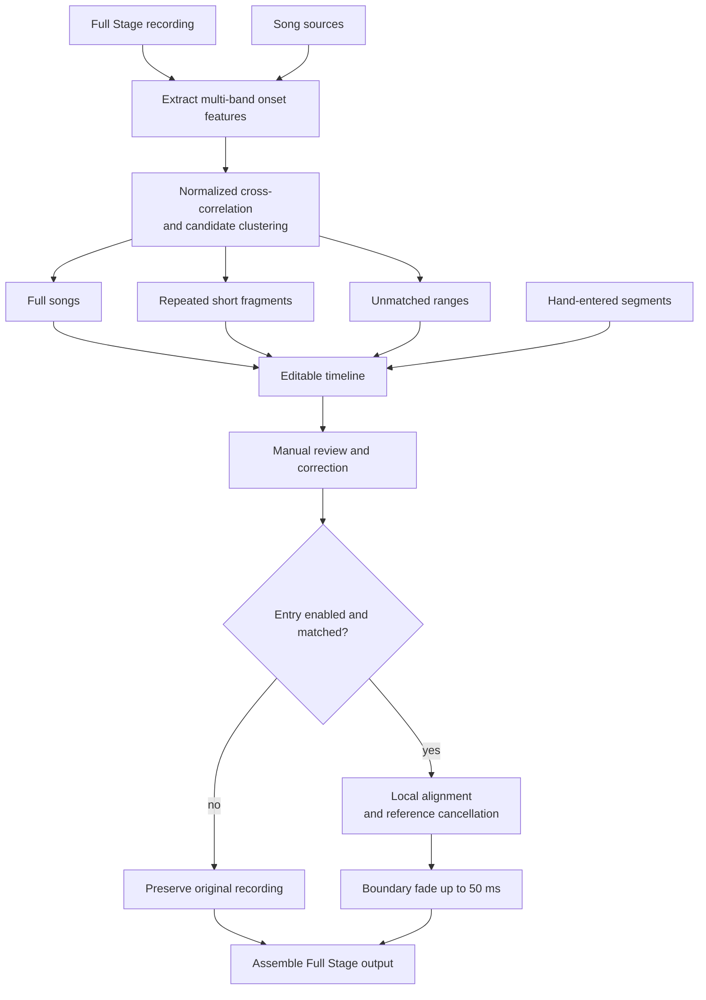

# Full Stage Processing

  <a href="../full-stage.md">简体中文</a> · <strong>English</strong>

## Goals and Boundaries

Full Stage automatically places multiple song sources within one continuous stage
recording, then applies reference cancellation only to matched ranges. Sources do not need to be
ordered in advance. A source that briefly repeats in an intro, advertisement, or outro can also
produce additional fragments.

Automatic analysis does not modify audio directly. It first generates an editable timeline and
renders only after user confirmation; unmatched ranges are always copied from the original full
recording.

## Feature Extraction

The full recording and every source are first converted to 4 kHz mono proxy signals. A short-time
Fourier transform is then calculated with a frame step of approximately 40 ms. Magnitudes are
compressed with `log1p`, positive spectral flux is retained, and the result is aggregated into 12
geometrically spaced frequency bands.

Each band has its median removed, is normalized by median absolute magnitude, and is clipped to
$[-8,8]$. Matching therefore focuses on onset changes rather than mastering loudness.

## Full-Song Candidates

Each source contributes up to seven distributed anchors. Anchor duration adapts to source length
within a range of approximately 6–20 seconds. Every anchor is matched against the Full Stage
features using normalized cross-correlation:

$$
s(k)=\frac{\langle \mathbf S_k,\mathbf Q\rangle}
{\|\mathbf S_k\|_2\,\|\mathbf Q\|_2+\varepsilon}
$$

An anchor hit is converted to the predicted Full Stage position of source time zero. Hits within
0.8 seconds are grouped into one candidate; votes from distinct anchors and their average score
together form the confidence. A candidate needs support from multiple anchors or a sufficiently
high individual score.

After all sources are searched independently, candidates are sorted by votes and confidence. At
most one full-song position is selected for each source, and a candidate overlapping an
already selected song by more than two seconds is rejected. The final timeline is ordered by
stage start time.

## Repeated Short Fragments

To identify short quotations in intros, outros, or advertisements, the algorithm additionally
scans each source with a ten-second window and five-second step, paying particular attention to
approximately the first and last 75 seconds of the full recording. In addition to the multi-anchor
and confidence thresholds, a candidate is verified by secondary cross-correlation over the first
difference of the 4 kHz waveforms.

A short fragment must be at least approximately five seconds long and must not overlap a detected
full song or another fragment substantially. The user can decide whether to include these
fragments before rendering.

## Timeline Model

Timeline entries have these kinds:

| Kind | Meaning | Default processing |
|---|---|---|
| Full song | The primary full-length match for a source | Reference cancellation enabled |
| Short fragment | A local reuse of the same source | User-selectable |
| Unmatched | A gap without reliable source coverage | Preserve original audio |
| Manual | A segment the user entered; the confidence column reads "Manual" | Treated as a full song |

Each matched entry records the stage start/end times, source file, source start/end times,
confidence, and enabled state. The model rejects negative times, zero-length ranges, matched
entries without a source, and out-of-range confidence.

After detected occupied ranges are merged, any gap of at least 0.25 seconds produces an unmatched
entry. Sources that were not detected are listed separately for manual review.

### Manual Segments and Spliced Backing Tracks

The analysis places at most one full-song position per source, and the fragment scan is weighted
toward the first and last 75 seconds of the stage. A **spliced backing track** — the same song cut
into pieces and replayed in an order the performance calls for — is outside what that search can
reconstruct.

The timeline therefore accepts hand-entered rows through "Add segment". A new row lands at the
start of the first unidentified range, and the editable stage-time and source-range columns move
it to its real position. Manual segments are full songs rather than fragments: rendering gates
fragments behind a switch, and an entry the user typed in should not be silently skipped by it.
The confidence column reads "Manual" rather than inventing a detection score.

Only manual segments can be removed. Detected entries are skipped by clearing their checkbox and
stay in the list for review.

A spliced backing track can also be handled without the full-stage feature: cut the source into
the performance's order first, then run it through single mode as one continuous song. That
returns it to a single continuous alignment problem, but the splice points have to be accurate to
within tens of milliseconds — local delay tracking corrects at most 2 ms per 0.1 s, so a half
second of error takes about 25 seconds to absorb, and cancellation fails throughout.

## Segmented Rendering

Rendering first creates a floating-point buffer with the same duration and sample rate as the full
recording and copies the original audio in full. It then processes each enabled full song and
optional short fragment:

1. Read the source and resample it to the Full Stage sample rate.
2. Slice the stage and source ranges specified by the timeline.
3. Optionally perform local drift alignment.
4. Measure how well both the original timeline position and drift-aligned result explain the stage
   audio; use drift alignment only when the new result is no worse.
5. Process the segment with reference-mask cancellation. Reconstruction uses only the original
   stage mix and never mixes the source waveform into the result.
6. Blend the result into the full-recording copy with fades of up to 50 ms at both boundaries.

After all segments are complete, a Full Stage result below 96 kHz is resampled to 96 kHz with
high-quality soxr; a higher original rate is preserved. The result is then written atomically as
24-bit PCM WAV. Upsampling changes the export format but does not add spectral detail absent from
the original recording.

Explanatory quality is calculated by fitting small $2\times2$ direct models in multiple windows,
measuring their residual ratios, and taking the median so that one abnormal window cannot dominate
the decision. This selection gate prevents an already correct timeline position from being damaged
by an unreliable local-delay trajectory.

## Failure Strategy

- Rendering is rejected when there are no usable matches, rather than producing an input-identical
  file that appears successful.
- The output cannot overwrite the full recording or any source, and the full recording cannot also
  be used as a song source.
- Temporary audio for each segment is cleaned immediately after processing; mapped storage keeps
  memory use under control for the full output.
- Disabled or unmatched ranges are never replaced with silence, removed from the timeline, or
  allowed to change the original duration.
