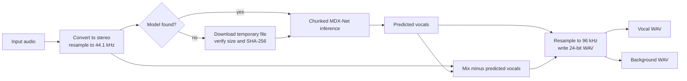

# AI Track Separation

<p align="left">
  <a href="../neural-separation.md">简体中文</a> · <strong>English</strong>
</p>

## Pipeline Overview

The AI workflow does not require a song source. The input is converted to stereo, resampled to
44.1 kHz, and passed to an MDX-Net ONNX model that predicts vocals:

$$
\widehat{\mathbf v}=f_{\theta}(\mathbf y)
$$

The background is calculated by direct subtraction:

$$
\widehat{\mathbf b}=\mathbf y-\widehat{\mathbf v}
$$

Model computation remains at 44.1 kHz. After inference, vocals and background are independently
resampled to 96 kHz with high-quality soxr. The pipeline then writes two 24-bit stereo WAV files:
`<song-name>_vocal.wav` and `<song-name>_background.wav`.



## Model Locations and Downloads

Models are searched in this order:

1. The directory supplied through the `--models-dir` job option;
2. The `PURIVOX_MODELS` environment variable;
3. The `models/` directory under the system application-data directory;
4. The `models/` directory at the development repository root.

If weights are not found, the application downloads them from TRvlvr's public UVR model releases to
the explicit directory or system application-data directory. The transfer runs on Qt's network
stack: `QNetworkAccessManager` issues the request, so it follows the system proxy configuration and
the release host's safe redirects and applies a 120-second timeout to a stalled transfer. Progress
comes from the `downloadProgress` signal, and cancellation aborts the reply from a polling timer.

Writing goes through `QSaveFile`: bytes land in a temporary file beside the destination while the
SHA-256 digest is computed incrementally, and only a transfer whose size and digest both match the
catalogue is committed with an atomic rename. Any failure, mismatch, or cancellation calls
`cancelWriting()`, so no partial file survives and no model can appear present but corrupt.

A `QFileSystemWatcher` on the search directories keeps the AI page's ready/needs-download label
current, so a weight that finishes downloading or is copied in by hand updates it immediately
without reopening the page.

The current catalog contains four model definitions:

| Model ID | Display name | Weights file |
|---|---|---|
| `mdxnet_1` | UVR-MDX-NET 1 | `UVR_MDXNET_1_9703.onnx` |
| `mdxnet_main` | UVR-MDX-NET Main | `UVR_MDXNET_Main.onnx` |
| `kim_vocal` | Kim Vocal 1 | `Kim_Vocal_1.onnx` |
| `kuielab_b` | kuielab B Vocals | `kuielab_b_vocals.onnx` |

Model weights are excluded from the wheel, source distribution, and standalone application.

## Model Specifications

The application looks up the model file's MD5 digest in `src/resources/model_data.json` to obtain
the FFT size, frequency dimension, time dimension, compensation factor, and primary-stem name.
The exact digests of all four built-in models are registered in that table; a model without a
matching record is rejected.

The ONNX input must be a four-dimensional tensor:

```text
[batch, 4, frequency dimension, time dimension]
```

The four planes are, in order, the real and imaginary parts of the left channel followed by the
real and imaginary parts of the right channel. Fixed dimensions must match the model
specification; the batch dimension may be symbolic in the exported model. ONNX Runtime currently
uses the CPU execution provider.

## Spectral Transform and Chunking

A short-time Fourier transform is applied to each channel. The required frequency range is
cropped and assembled into the input tensor. The lowest three frequency bins are cleared to match
the MDX-Net inference procedure. Real and imaginary model outputs are recombined into a complex
spectrum, unpredicted high-frequency bins are restored, and the inverse transform reconstructs the
waveform.

For long audio, the chunk size is calculated from the model's `hop`, `segment_size`, and `n_fft`.
Adjacent prediction chunks use Hann-windowed overlap-add:

$$
\widehat y[n]=\frac{\sum_k w_k[n],\widehat y_k[n]}
{\max\left(\sum_k w_k[n],\varepsilon\right)}
$$

The denominator is stored in separate temporary mapped audio so that overlap regions do not
change loudness. The compensation factor from the model specification is applied after merging.

## Resource and Quality Boundaries

- Inference input, output, and overlap dividers use `float32`; long-audio output is stored in
  mapped files.
- Both the inference loop and final normalization loop respond to cooperative cancellation.
- All models share one processing pipeline, but their training targets and timbral preferences
  differ. A model name does not imply a fixed ranking across all material.
- The background is the original mix minus the predicted vocals, not the output of a second
  independent model. Vocal-prediction errors therefore appear directly in the background.
- The 96 kHz / 24-bit values describe the exported files. Model inference remains at 44.1 kHz,
  and upsampling cannot create high-frequency detail that the model did not predict.
