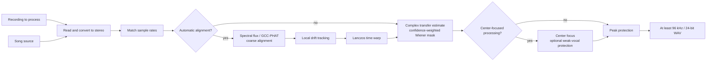

# Reference-Guided Vocal Isolation

  <a href="../reference-removal.md">简体中文</a> · <strong>English</strong>

## Problem Definition

Let the stereo recording to process be $\mathbf{y}(t)$ and the song source be
$\mathbf{x}(t)$. Content that is absent from the song source—such as live vocals, speech, and
ambient sound—is denoted by $\mathbf{v}(t)$. Reference-mask cancellation estimates a complex,
time- and frequency-varying $2\times2$ transfer matrix in the STFT domain:

$$
\mathbf{y}(t) \approx \mathbf{H}(t)\mathbf{x}(t) + \mathbf{v}(t)
$$

The matrix is used only to estimate the source-explained power $P_x(f,n)$. The target power and
linked soft mask are:

$$
\widehat P_v=\max(P_y-C P_x,\,0.05^2P_y),\qquad
M=\sqrt{\frac{\widehat P_v}{P_y+\varepsilon}}
$$

Here, $C$ is the coherence confidence between the mix and the predicted source. Strength
$\alpha\in[0,1]$ continuously controls the processing amount through
$M_\alpha=1-\alpha(1-M)$. The output is always the original mix's complex spectrum multiplied by
a real-valued mask; the source waveform or predicted source spectrum is never subtracted
directly.

Reference cancellation requires the stage/live recording to contain backing audio corresponding
to the selected song source. A different arrangement or key, severe dynamics processing, or
additional instruments cannot be corrected using time and gain adjustments alone.

## Overall Flow

## Time Alignment

### Coarse Alignment

A camera track recorded at the venue may have low waveform correlation with the matching song
source even when note onsets remain similar. The implementation therefore starts with multi-band
spectral-flux features and searches for a significant correlation peak over up to approximately
60 seconds of shared material. If the feature peak is unreliable, it tries GCC-PHAT and ordinary
cross-correlation in sequence.

GCC-PHAT retains only the phase of the cross-power spectrum:

$$
R_{\mathrm{PHAT}}(\tau)
=\mathcal{F}^{-1}\!\left(
\frac{Y(f)\,\overline{X(f)}}
{\lvert Y(f)\,\overline{X(f)}\rvert+\varepsilon}
\right)
$$

The correlation peak gives the coarse delay. The implementation first searches a smaller range;
if the peak is close to a boundary, it expands the search to at most approximately 20 seconds.
This reduces the chance of meaningless long-distance matches.

### Local Drift

Clock differences between recording devices can produce correct alignment at the beginning but
increasing error toward the end. The implementation downsamples the audio into proxy signals,
estimates local delay every 0.1 seconds, and limits the maximum change between adjacent estimates.
Low-correlation windows retain the predicted value, and a three-point median filter suppresses
jumps.

After obtaining the delay curve $d(t)$, the source is resampled as

$$
x_{\mathrm{aligned}}(t)=x\bigl(t-d(t)\bigr)
$$

Non-integer positions are interpolated with a radius-3 Lanczos kernel, and the result is written
to mapped storage in blocks.

## Reference-Mask Cancellation

The STFT window targets approximately 46 ms. Its length is rounded to the nearest power of two at
the current sample rate and constrained to 512–4096 points; the hop is one quarter of the window.
At each frequency bin, a complex transfer matrix is estimated from the smoothed source covariance
and mix–source cross-power. Diagonal regularization is added to the covariance, and the total
transfer gain for each output channel is limited to 2×.

The algorithm performs an initial fit, lowers the weights of vocal, cheering, and abnormal
transients according to the prediction residual, then performs a second weighted fit. The GUI
uses a fixed three-second statistical context that balances adaptation speed and stability,
instead of asking users to judge a low-level parameter whose effect is difficult to predict. The
CLI retains `--sigma` values of 1, 3, 8, or 16 seconds for diagnosing unusual material.

The predicted source contributes only to the power estimate. The algorithm combines short-term
coherence over approximately 120 ms with long-term coherence controlled by `sigma`, increasing
reference confidence only when local agreement and longer-term stability both hold. Confidence is
then stabilized in roughly one-ERB auditory bands, weighted by predicted-source power. This
suppresses isolated-bin flicker without applying broad-band attenuation directly to the vocal.
Target power is updated from 80% history and 20% current value to further reduce musical noise.
Positive spectral flux that appears in the mix without a corresponding change in the predicted
source raises the mask, protecting consonants, breaths, cheering, and other non-source transients.
Both channels share a power-weighted mask, avoiding image jumps from independent channel gating.

A silent or unrelated song source produces low confidence and remains close to bypass. At zero
strength, the STFT is skipped entirely and the input is copied sample for sample.

The full recording uses 12–28-second blocks selected from `sigma`, avoiding a fixed 30-second
collection of complex spectra for a short statistical context. Adjacent blocks overlap by at least
two seconds, increasing with `sigma` to half of the statistical context and capped at one third of
the block length. They use squared-cosine and squared-sine crossfade weights:

$$
w_{\mathrm{old}}(\theta)=\cos^2\theta,\qquad
w_{\mathrm{new}}(\theta)=\sin^2\theta
$$

Their sum is always 1, reducing seams at block boundaries.

### Research Basis and Boundaries

- Gorlow, Ramona, and Pachet's [live accompaniment-cancellation study](https://arxiv.org/abs/1611.08905) compares adaptive noise cancellation, spectral subtraction, and short-time ERB-band Wiener filtering. The implementation therefore uses a short-time frequency-domain soft mask and ERB confidence stabilization rather than switching to time-domain LMS.
- Boll's [classic spectral-subtraction paper](https://doi.org/10.1109/TASSP.1979.1163209) describes magnitude subtraction and residual-noise problems. This implementation retains a subtractive power target while adding reference-conditioned coherence, a mask floor, and transient protection instead of directly applying hard spectral subtraction.
- Avery Lee's [Center Cut](https://www.virtualdub.org/blog2/entry_102.html) and ADRess-style methods depend on center imaging, inter-channel level differences, or phase differences. They apply only to the explicit optional center processing below and are not part of this default reference-cancellation optimization.

These papers provide algorithm structure and failure boundaries; they do not guarantee an improvement on every real performance. Matched-segment, loudness-matched A/B listening remains the acceptance criterion.

## Optional Center-Focused Processing

After basic cancellation, **Emphasize live vocals** can be enabled explicitly. The implementation
applies a short-time Fourier transform to the left and right channels, estimates the phantom-center
share from left/right power, cross-spectral coherence, and phase difference, and primarily retains
coherent center content between approximately 80 Hz and 14 kHz.

**Protect quiet live vocals** is effective only when vocal emphasis is enabled. When center
confidence is insufficient, it falls back to ordinary Mid content instead of restoring the full
left and right channels. This protects quieter vocals where possible without bringing back the
entire wide source-derived layer.

Both options alter spatial presentation and are outside the core reference-mask path. Decide
whether to enable them by comparing the same source material through listening.

## Output Protection and Validation

After processing, non-finite values are replaced with finite values and peaks are kept within
range when necessary. Results below 96 kHz are resampled to 96 kHz with high-quality soxr, while
higher original rates are preserved, and output is written as 24-bit PCM WAV. This resampling
standardizes the export format but cannot restore high-frequency detail absent from the input.

Algorithm tests cover time offsets, local drift, inverted polarity, frequency-dependent room
transfer, unrelated sources, rejection of source-only replacement lyrics, matrix crosstalk, block
seams, center focus, and weak-vocal protection. Synthetic metrics only detect implementation
regressions. Real material must still be exported with identical input and settings for direct
comparison, listening closely to vocal level, sibilance, breathing, harmonies, reverb tails, and
audience sound.
