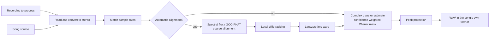

# Reference-Guided Vocal Isolation

  <a href="../reference-removal.md">简体中文</a> · <strong>English</strong>

## Problem Definition

Let the stereo recording to process be $\mathbf{y}(t)$ and the song source be
$\mathbf{x}(t)$. Content that is absent from the song source—such as live vocals, speech, and
ambient sound—is denoted by $\mathbf{v}(t)$. Reference cancellation estimates a complex,
time- and frequency-varying $2\times2$ transfer matrix in the STFT domain:

$$
\mathbf{y}(t) \approx \mathbf{H}(t)\mathbf{x}(t) + \mathbf{v}(t)
$$

Cancellation runs in two stages, following the same arrangement used by acoustic echo cancellers:
complex subtraction removes the predicted accompaniment vector, and a soft mask then suppresses
whatever the linear stage could not describe cleanly. Writing the prediction as
$\mathbf{d}=\mathbf{H}\mathbf{x}$, the first stage is

$$
\mathbf{e}=\mathbf{y}-\gamma\,\mathbf{d},\qquad
\lvert\mathbf{e}\rvert\leftarrow\min\bigl(\lvert\mathbf{e}\rvert,\lvert\mathbf{y}\rvert\bigr)
$$

The second expression constrains the linear stage so that it can only remove energy, never add
any. The residual still carries accompaniment the transfer could not describe — mostly
reverberation ringing past the window and residual misalignment — whose size comes from a
regression of the residual power on the power that was removed (see "Estimating the Leakage") and
is handed to the linked soft mask:

$$
\widehat P_v=\max(P_e-\rho P_d,\,0.05^2P_e),\qquad
M=\sqrt{\frac{\widehat P_v}{P_e+\varepsilon}}
$$

Strength $\alpha\in[0,1]$ interpolates on the complex spectrum:

$$
\mathbf{s}=\mathbf{y}+\alpha\,(M\mathbf{e}-\mathbf{y})
$$

When nothing is subtracted, $\mathbf{e}=\mathbf{y}$ and this reduces to
$M_\alpha=1-\alpha(1-M)$, the original mask-only path, so $\alpha=0$ is still a complete bypass
and $\alpha$ is still monotonic.

Subtracting is safe here because the per-bin least-squares prediction is itself the projection of
$\mathbf{y}$ onto $\mathrm{span}(\mathbf{x})$. Content present in the reference but absent from the
mix, a changed lyric or a harmony only the source has, satisfies
$\mathbb{E}[y\overline{x_j}]\approx 0$, so both $h$ and $d$ fall to zero and that content is never
predicted in the first place, let alone injected. $\gamma$ also falls to zero in those places, and
with the no-amplification bound on top, the three safeguards are independent of one another.

Reference cancellation requires the stage/live recording to contain backing audio corresponding
to the selected song source. A different arrangement or key, heavy dynamics processing, or
additional instruments cannot be corrected with time and gain adjustments alone.

## Overall Flow

## Time Alignment

### Coarse Alignment

A camera track recorded at the venue may have low waveform correlation with the matching song
source even when note onsets remain similar. The implementation therefore starts with multi-band
spectral-flux features (`shared.dsp.log_flux_bands()`, shared with full-stage matching) and searches
for a significant correlation peak over up to approximately 60 seconds of shared material. A channel
whose bands are too flat rejects the whole estimate; if the feature peak is unreliable, it tries
GCC-PHAT and ordinary cross-correlation in sequence.

GCC-PHAT retains only the phase of the cross-power spectrum:

$$
R_{\mathrm{PHAT}}(\tau)
=\mathcal{F}^{-1}\!\left(
\frac{Y(f)\,\overline{X(f)}}
{\lvert Y(f)\,\overline{X(f)}\rvert+\varepsilon}
\right)
$$

The correlation peak gives the coarse delay. The implementation first searches a smaller range;
if the peak is close to a boundary, it expands the search to at most approximately 20 seconds.
This reduces the chance of meaningless long-distance matches.

### Local Drift

Clock differences between recording devices can produce correct alignment at the beginning but
increasing error toward the end. The implementation resamples the audio into anti-aliased 16 kHz
proxy signals,
estimates local delay every 0.1 seconds, and limits the maximum change between adjacent estimates.
Low-correlation windows retain the predicted value, and a three-point median filter suppresses
jumps.

What limits local delay accuracy is the proxy's *bandwidth*, not its sample grid. Measured end to
end on a drifting broadband reference, raising the proxy rate from 2 kHz to 16 kHz lifted
cancellation depth by roughly 10 dB while alignment runtime stayed flat: the tracking loop still
advances once every 0.1 seconds, only each correlation gets longer.

The delay curve is kept on the proxy sample grid, with no sub-sample refinement: a constant
fractional delay is already absorbed by the per-bin complex transfer as a phase ramp.

After obtaining the delay curve $d(t)$, the source is resampled as

$$
x_{\mathrm{aligned}}(t)=x\bigl(t-d(t)\bigr)
$$

Non-integer positions are interpolated with a radius-3 Lanczos kernel, and the result is written
to mapped storage in blocks. The kernel depends only on the fractional part of the source
position, so it is read from a precomputed 8192-phase table rather than evaluating `sinc` per
output sample; the table's quantisation error sits near -80 dBFS. Sliding window energy in the
local tracker is computed from a prefix sum, which takes it from O(N*M) to O(N).

## Coherent Cancellation

The STFT window targets approximately 46 ms. Its length is rounded to the nearest power of two at
the current sample rate and constrained to 512–4096 points; the hop is one quarter of the window.
At each frequency bin, a complex transfer matrix is estimated from the smoothed source covariance
and mix–source cross-power. Diagonal regularization is added to the covariance, and the total
transfer gain for each output channel is limited to 2×.

The normal equations are $R\,h=c$ with $R_{jk}=\mathbb{E}[x_k\overline{x_j}]$ and
$c_j=\mathbb{E}[y\overline{x_j}]$. **The index order matters**: filling $R_{jk}$ with
$\mathbb{E}[x_j\overline{x_k}]$ transposes the system and solves for a different transfer,
measured at roughly 3.4 dB of cancellation depth on a stereo reference whose channels are
strongly correlated across a small inter-channel delay — the normal case for real backing tracks.
Only the lower triangle is built, and it is solved with an $LDL^{H}$ factorisation vectorised
over whole spectra; stacking each time-frequency cell into a tensor for `numpy.linalg.solve`
makes LAPACK run once per cell, and measured about seven times slower.

### Reliability of the Transfer Estimate

How much to subtract depends on how much the transfer estimate can be trusted, so it is better
if that confidence is not a second quantity computed after the fact. At the least-squares optimum
$\mathbb{E}[|Hx|^2]=h^{H}c$, so the share of the mixture the reference explains can be read
directly from the solve:

$$
\gamma^2=\frac{\mathrm{Re}\,(h^{H}c)}{P_y+\varepsilon}
$$

This multiple coherence comes with the solution for free; no second cross-spectrum coherence
between the mixture and the prediction is needed.

A least-squares fit over a finite window always explains part of the mixture by chance, and the
expected size of that accident is exactly $p/N_{\text{eff}}$ for order $p$. Removing it gives the
adjusted coherence:

$$
N_{\text{eff}}=\max\Bigl(W\cdot\tfrac{\text{hop}}{n_{\text{fft}}}\cdot 1.5,\;p+2\Bigr),\qquad
\gamma^2_{\text{adj}}=1-(1-\gamma^2)\frac{N_{\text{eff}}}{N_{\text{eff}}-p}
$$

$W$ is the smoothing window in frames, 1/8 is the effective independence of adjacent frames, and
1.5 is the effective number of independent bins under the $\sigma=1$ frequency Gaussian. The frame
independence was measured rather than derived: reading $\text{hop}/n_{\text{fft}}$ literally at 75%
overlap gives 1/4, but the Hann window has its own correlation between overlapping frames and the
frequency Gaussian delivers fewer independent bins than its nominal count under a four-bin main
lobe, both of which make that reading too optimistic. The property this correction buys can be
measured directly: with a completely unrelated reference the bypass is exact (correlation 1.000000,
RMSE 0). That is what guarantees an unrelated source is never subtracted.

$W$ also has to be clamped to the frames the block actually holds before it is used. The box filter
reflects at the block edge rather than inventing samples, so a context wider than the block is worth
only what the block contains; reading the nominal width overstates the observation count, and does
so in exactly the short blocks where the overfit bias is worst.

The estimation error variance of the transfer is roughly $p/N_{\text{eff}}$ of the unexplained
power, which in turn fixes the shrinkage that minimises the mean square error:

$$
\gamma=\frac{\gamma^2_{\text{adj}}}{\gamma^2_{\text{adj}}+\frac{p}{N_{\text{eff}}}\bigl(1-\gamma^2_{\text{adj}}\bigr)+\varepsilon}
$$

A reference that explains nothing gives $\gamma=0$ and is not subtracted at all; the better it
explains, the closer the subtraction comes to removing the whole prediction.

The diagonal loading needs a floor for a similar reason. Added purely in proportion to the
local reference power, the regularisation collapses along with it: where the reference falls silent
for a moment while the mixture does not, the equations have almost nothing to go on and the
transfer runs away until the gain cap stops it. The loading is therefore never smaller than the
value that bin would receive at its own median level.

Nor can the scale used to judge outliers be one the outliers themselves can raise. A smoothed
arithmetic mean is dragged up by the very live transients it is meant to suppress, whereas a
geometric mean is not; it is the same O(N) smoother, read in the log domain.

### Estimating the Leakage

What remains correlated after the linear stage is mostly reverberation ringing past the window and
residual misalignment. The question is how much of the residual is still accompaniment, and it
cannot be dodged by looking only at reference-dominant frames: when the live source plays
throughout, there are no frames where the reference sounds alone, so an intercept-free ratio
$\rho=P_e/P_d$ measures the live source as leakage and the mask then removes it along with the rest.

The leakage is therefore a power regression carrying an intercept, in exactly the form the
incoherent path below uses:

$$
P_e \approx \rho(f,n)\,P_d(f,n) + c(f,n)
$$

$\rho P_d$ rises and falls with the accompaniment that was actually there, so it is leakage; the
slowly varying $c$ does not, so it is live content, and only the first term may be removed. $\rho$
is thresholded by a smoothstep on the adjusted correlation the same way, and is bounded by the
residual it was found in, so one weak-evidence cell cannot drive the mask to the floor.

### The Incoherent Power Path

The failure mode measured on real material turns out not to be reverberation but the loss of the
phase relationship altogether. On a KWDA stage recording the alignment itself is sub-sample accurate
(residual lag 0.00-0.04 ms) and the structure and tempo agree (frame-energy envelope correlation
0.896), yet the complex multiple coherence still holds 0.68 below 100 Hz and falls to 0.02-0.05
above 500 Hz. Widening the analysis window from 43 ms to 1365 ms, a full 32 times, lifts the
achievable depth only from 2.30 dB to 4.24 dB, so a window shorter than the room does not explain
this.

The magnitudes of that same material do still track each other, with a log-magnitude spectrogram
correlation of 0.45–0.72 by band. A power-domain regression therefore runs alongside the complex
path:

$$
P_y \approx g(f,n)\,P_x + c(f,n)
$$

The intercept is there on purpose: $gP_x$ is the part that follows the source and the slowly varying
$c$ is the live content, so only the former may be removed. The slope is constrained non-negative,
since more accompaniment in the source cannot mean less of it on stage, and is then gated through a
smoothstep on the same degrees-of-freedom-adjusted correlation. Unrelated music shares loudness
envelopes to some degree, and that gate is what keeps an unrelated source from being suppressed.

The mask ends up removing whichever of the two paths explains more, less whatever the coherent stage
already took out. On that stage recording the removed energy measures 6.85 dB.

This path removes content whose power follows the source rather than content the waveform shows to
come from the source, so it relies on much weaker evidence than the coherent path. Driving the mask
from it directly makes the mask open and close cell by cell, which on badly phase-decorrelated
material is audible as musical noise, so two bounds keep that in check: a single cell's incoherent
claim is capped at a share of the residual power (`_INCOHERENT_MAX_SHARE`), so weak evidence can
never push the mask to the floor, and the mask ratio is formed from powers smoothed in time
(`_MASK_POWER_SMOOTH`) before the existing narrow Gaussian pass, which flattens most of the
fluctuation before it reaches the mask. The remaining knobs are `_INCOHERENT_OVERSUBTRACTION`,
`_MASK_FLOOR` and `_MASK_SMOOTHING`; when $gamma^2$ is only 0.02–0.05 above 500 Hz there is simply not enough information to decide whether
a given cell is accompaniment, which is why the smoothstep gate still shuts the path off at low
confidence.

### Research Basis and Boundaries

- Gorlow, Ramona, and Pachet's [live accompaniment-cancellation study](https://arxiv.org/abs/1611.08905) compares adaptive noise cancellation, spectral subtraction, and short-time ERB-band Wiener filtering. This implementation uses a simpler coherence-weighted frequency-domain soft mask rather than time-domain LMS or a separate ERB voting layer.
- Boll's [classic spectral-subtraction paper](https://doi.org/10.1109/TASSP.1979.1163209) describes magnitude subtraction and residual-noise problems. This implementation retains a subtractive power target while adding reference-conditioned coherence, a mask floor, and narrow time-frequency smoothing instead of directly applying hard spectral subtraction.
- Avery Lee's [Center Cut](https://www.virtualdub.org/blog2/entry_102.html) and ADRess-style methods depend on center imaging, inter-channel level differences, or phase differences, and are unrelated to this implementation: they read only the spatial relationship between two channels, whereas reference cancellation reads the evidence the song source provides.
- The convolutive transfer function (CTF) literature explains why the multiplicative narrowband approximation fails under long reverberation and how a finite set of frame taps replaces it, for example [joint dereverberation and blind source separation with a hybrid CTF model](https://doi.org/10.1016/j.apacoust.2024.110168). Schröter et al.'s [DeepFilterNet](https://arxiv.org/abs/2110.05588) and Tammen and Doclo's [deep multi-frame MVDR](https://arxiv.org/abs/2011.10345) are the learned form of the same idea: a complex filter across frames per time-frequency bin rather than a point-wise mask.
- Engineering systems with the same structure are useful references. WebRTC's AEC3 is likewise "known reference plus unknown transfer plus double-talk", and its partitioned-block frequency-domain adaptive filter, delay estimation, and residual echo suppressor map onto the alignment, transfer estimation, and coherence-weighted mask here.

These papers provide algorithm structure and failure boundaries; they do not guarantee an improvement on every real performance. Matched-segment, loudness-matched A/B listening remains the acceptance criterion.

## Output Protection and Validation

After processing, non-finite values are replaced with finite values and peaks are kept within
range when necessary. The result is written as PCM WAV at the song's own sample rate and bit
depth: cancellation neither changes the time base nor creates new spectrum, so raising the export
to a fixed floor would only enlarge the file.

Algorithm tests cover time offsets, local drift, inverted polarity, frequency-dependent room
transfer, unrelated sources, rejection of source-only replacement lyrics, matrix crosstalk,
normal-equation orientation on a phase-correlated stereo reference, a live source that never stops
(which guards the leakage regression's intercept), and block seams. Synthetic
metrics only detect implementation regressions. Real material must still be exported with identical input and settings for direct
comparison, listening closely to vocal level, sibilance, breathing, harmonies, reverb tails, and
audience sound.
