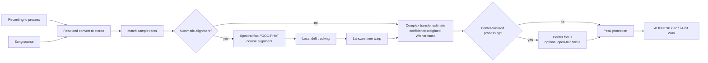

# Reference-Guided Vocal Isolation

  <a href="../reference-removal.md">简体中文</a> · <strong>English</strong>

## Problem Definition

Let the stereo recording to process be $\mathbf{y}(t)$ and the song source be
$\mathbf{x}(t)$. Content that is absent from the song source—such as live vocals, speech, and
ambient sound—is denoted by $\mathbf{v}(t)$. Reference cancellation estimates a complex,
time- and frequency-varying $2\times2$ transfer matrix in the STFT domain:

$$
\mathbf{y}(t) \approx \mathbf{H}(t)\mathbf{x}(t) + \mathbf{v}(t)
$$

Cancellation runs in two stages, in the same arrangement acoustic echo cancellers use: a complex
subtraction removes the predicted accompaniment vector, and a soft mask then suppresses whatever the
linear stage could not describe cleanly. Writing the prediction as $\mathbf{d}=\mathbf{H}\mathbf{x}$,
the first stage is

$$
\mathbf{e}=\mathbf{y}-\gamma\,\mathbf{d},\qquad
\lvert\mathbf{e}\rvert\leftarrow\min\bigl(\lvert\mathbf{e}\rvert,\lvert\mathbf{y}\rvert\bigr)
$$

The second expression constrains the linear stage so that it can only take energy away, never add
any. The residual still carries accompaniment the transfer could not describe, mostly reverberation
ringing past the window and residual misalignment, whose size is estimated as a per-bin leakage
ratio $\rho(f)$ and handed to the linked soft mask:

$$
\widehat P_v=\max(P_e-\beta\rho P_d,\,0.05^2P_e),\qquad
M=\sqrt{\frac{\widehat P_v}{P_e+\varepsilon}}
$$

Strength $\alpha\in[0,1]$ interpolates on the complex spectrum:

$$
\mathbf{s}=\mathbf{y}+\alpha\,(M\mathbf{e}-\mathbf{y})
$$

With nothing subtracted $\mathbf{e}=\mathbf{y}$ and this reduces to $M_\alpha=1-\alpha(1-M)$, the
original mask-only path, so $\alpha=0$ is still a complete bypass and $\alpha$ is still monotonic.

Subtracting is safe here because the per-bin least-squares prediction is itself the projection of
$\mathbf{y}$ onto $\mathrm{span}(\mathbf{x})$. Content present in the reference but absent from the
mix, a changed lyric or a harmony only the source has, satisfies
$\mathbb{E}[y\overline{x_j}]\approx 0$, so both $h$ and $d$ fall to zero and that content is never
predicted in the first place, let alone injected. $\gamma$ also falls to zero in those places, and
with the no-amplification bound on top the three safeguards are independent of one another. The
direct-residual path removed from this project early on subtracted a broadband real matrix in the
time domain, with no per-bin projection, no confidence and no bound on the result, which is why
reference-only content ended up inverted in its output.

Reference cancellation requires the stage/live recording to contain backing audio corresponding
to the selected song source. A different arrangement or key, severe dynamics processing, or
additional instruments cannot be corrected using time and gain adjustments alone.

## Overall Flow

## Time Alignment

### Coarse Alignment

A camera track recorded at the venue may have low waveform correlation with the matching song
source even when note onsets remain similar. The implementation therefore starts with multi-band
spectral-flux features (`shared.dsp.log_flux_bands()`, shared with full-stage matching) and searches
for a significant correlation peak over up to approximately 60 seconds of shared material. A channel
whose bands are too flat rejects the whole estimate; if the feature peak is unreliable, it tries
GCC-PHAT and ordinary cross-correlation in sequence.

GCC-PHAT retains only the phase of the cross-power spectrum:

$$
R_{\mathrm{PHAT}}(\tau)
=\mathcal{F}^{-1}\!\left(
\frac{Y(f)\,\overline{X(f)}}
{\lvert Y(f)\,\overline{X(f)}\rvert+\varepsilon}
\right)
$$

The correlation peak gives the coarse delay. The implementation first searches a smaller range;
if the peak is close to a boundary, it expands the search to at most approximately 20 seconds.
This reduces the chance of meaningless long-distance matches.

### Local Drift

Clock differences between recording devices can produce correct alignment at the beginning but
increasing error toward the end. The implementation resamples the audio into anti-aliased 16 kHz
proxy signals,
estimates local delay every 0.1 seconds, and limits the maximum change between adjacent estimates.
Low-correlation windows retain the predicted value, and a three-point median filter suppresses
jumps.

What limits local delay accuracy is the proxy's *bandwidth*, not its sample grid. Measured end to
end on a drifting broadband reference, raising the proxy rate from 2 kHz to 16 kHz lifted
cancellation depth by roughly 10 dB while alignment runtime stayed flat: the tracking loop still
advances once every 0.1 seconds, only each correlation gets longer. The wider band also admits
more live-only content (vocals, cymbals) into the correlation, but the same sweep improved
monotonically even with a loud live source present, so no cost from that trade was observed.

The delay curve is **deliberately kept on the proxy sample grid**. Refining the peak to
sub-sample resolution with parabolic interpolation was measured to *reduce* cancellation depth: a
constant fractional delay is already absorbed by the per-bin complex transfer as a phase ramp, so
the refinement only adds per-window noise to the lag curve without removing any error the mask
cares about.

After obtaining the delay curve $d(t)$, the source is resampled as

$$
x_{\mathrm{aligned}}(t)=x\bigl(t-d(t)\bigr)
$$

Non-integer positions are interpolated with a radius-3 Lanczos kernel, and the result is written
to mapped storage in blocks. The kernel depends only on the fractional part of the source
position, so it is read from a precomputed 8192-phase table rather than evaluating `sinc` per
output sample; the table's quantisation error sits near -80 dBFS. Sliding window energy in the
local tracker is computed from a prefix sum, which takes it from O(N*M) to O(N).

## Coherent Cancellation

The STFT window targets approximately 46 ms. Its length is rounded to the nearest power of two at
the current sample rate and constrained to 512–4096 points; the hop is one quarter of the window.
At each frequency bin, a complex transfer matrix is estimated from the smoothed source covariance
and mix–source cross-power. Diagonal regularization is added to the covariance, and the total
transfer gain for each output channel is limited to 2×.

The normal equations are $R\,h=c$ with $R_{jk}=\mathbb{E}[x_k\overline{x_j}]$ and
$c_j=\mathbb{E}[y\overline{x_j}]$. **The index order matters**: filling $R_{jk}$ with
$\mathbb{E}[x_j\overline{x_k}]$ transposes the system and solves for a different transfer,
measured at roughly 3.4 dB of cancellation depth on a stereo reference whose channels are
strongly correlated across a small inter-channel delay — the normal case for real backing tracks.
Only the lower triangle is built, and it is solved with an $LDL^{H}$ factorisation vectorised
over whole spectra; stacking each time-frequency cell into a tensor for `numpy.linalg.solve`
makes LAPACK run once per cell and measured about seven times slower.

### Reliability of the Transfer Estimate

How much to subtract depends on how far the transfer estimate can be trusted, so it is better if
that confidence is not a second quantity worked out after the fact. At the least-squares optimum
$\mathbb{E}[|Hx|^2]=h^{H}c$, which means how much of the mixture the reference explains can be read
straight off the solve:

$$
\gamma^2=\frac{\mathrm{Re}\,(h^{H}c)}{P_y+\varepsilon}
$$

This multiple coherence comes along with the solution for free. The earlier implementation worked
out a second cross-spectrum coherence between the mixture and the prediction, which cost three more
smoothing passes per channel and still carried the bias described below.

A least-squares fit over a finite window always explains part of the mixture by chance, and the
expected size of that accident is exactly $p/N_{\text{eff}}$ for order $p$. Removing it gives the
adjusted coherence:

$$
N_{\text{eff}}=\max\Bigl(W\cdot\tfrac{\text{hop}}{n_{\text{fft}}}\cdot 1.5,\;p+2\Bigr),\qquad
\gamma^2_{\text{adj}}=1-(1-\gamma^2)\frac{N_{\text{eff}}}{N_{\text{eff}}-p}
$$

$W$ is the smoothing window in frames, $\text{hop}/n_{\text{fft}}=1/4$ is the effective independence
of adjacent frames at 75% overlap, and 1.5 is the effective number of independent bins under the
$\sigma=1$ frequency Gaussian. The effect can be measured directly: faced with a completely
unrelated reference, the bypass is exact once the bias is removed (correlation 1.000000, RMSE 0)
and degrades to an RMSE of 0.00236 when it is not, which still sits inside the 0.01 gate but is an
order of magnitude worse. This is where the property that an unrelated source must not be
subtracted actually comes from.

$W$ also has to be clamped to the frames the block actually holds before it is used. The box filter
reflects at the block edge rather than inventing samples, so a context wider than the block is worth
only what the block contains; reading the nominal width overstates the observation count, and does
so in exactly the short blocks where the overfit bias is worst.

The estimation error variance of the transfer is roughly $p/N_{\text{eff}}$ of the unexplained
power, which in turn fixes the shrinkage that minimises the mean square error:

$$
\gamma=\frac{\gamma^2_{\text{adj}}}{\gamma^2_{\text{adj}}+\frac{p}{N_{\text{eff}}}\bigl(1-\gamma^2_{\text{adj}}\bigr)+\varepsilon}
$$

A reference that explains nothing gives $\gamma=0$ and is not subtracted at all; the better it
explains, the closer the subtraction comes to removing the whole prediction.

The diagonal loading needs a floor for the same kind of reason. Added purely in proportion to the
local reference power, the regularisation collapses along with it: where the reference falls silent
for a moment while the mixture does not, the equations have almost nothing to go on and the transfer
runs away until the gain cap stops it. The loading is therefore never smaller than what that bin
would get at its own median level.

The scale that outliers are judged against must not be one the outliers themselves can lift either.
A smoothed arithmetic mean is dragged up by the very live transients it ought to be suppressing,
whereas a geometric mean is not, and it is the same O(N) smoother read in the log domain.

What remains correlated after the linear stage is mostly reverberation ringing past the window and
residual misalignment. Its size is estimated as a per-bin leakage ratio $\rho(f)$ over the frames
the reference dominates, and a stage recording supplies plenty of those between vocal phrases.

### The Incoherent Power Path

The failure mode measured on real material turns out not to be reverberation but the loss of the
phase relationship altogether. On a KWDA stage recording the alignment itself is sub-sample accurate
(residual lag 0.00-0.04 ms) and the structure and tempo agree (frame-energy envelope correlation
0.896), yet the complex multiple coherence still holds 0.68 below 100 Hz and falls to 0.02-0.05
above 500 Hz. Widening the analysis window from 43 ms to 1365 ms, a full 32 times, lifts the
achievable depth only from 2.30 dB to 4.24 dB, so a window shorter than the room does not explain
this.

The magnitudes of that same material do still track each other, at a log-magnitude spectrogram
correlation of 0.45-0.72 by band. A power-domain regression therefore runs alongside the complex
path:

$$
P_y \approx g(f,n)\,P_x + c(f,n)
$$

The intercept is there on purpose: $gP_x$ is the part that follows the source and the slowly varying
$c$ is the live content, so only the former may be removed. The slope is constrained non-negative,
since more accompaniment in the source cannot mean less of it on stage, and is then gated through a
smoothstep on the same degrees-of-freedom-adjusted correlation. Unrelated music shares loudness
envelopes to some degree, and that gate is what keeps an unrelated source from being suppressed.

The mask ends up removing whichever of the two paths explains more, less whatever the coherent stage
already took out. On that stage recording this raised the removed energy from 3.29 dB to 6.85 dB,
at a cost of roughly 0.3-0.6 dB of depth and 0.03 of fidelity on the synthetic scenes where the
coherent path already worked well - spending headroom on clean material to make difficult material
usable.

The gain is not free. What this path removes is content whose power follows the source rather than
content the waveform shows to be the source, so it decides on much weaker evidence than the coherent
path and its mask opens and closes more violently. Listening on badly phase-decorrelated material
confirmed it: the accompaniment does come out cleanly, but audio quality drops audibly, from musical
noise caused by the mask fluctuating. This is an unresolved trade rather than a defect that can be
tuned away, because when $\gamma^2$ is only 0.02-0.05 above 500 Hz there is simply not enough
information to decide whether a given cell is accompaniment. The parameters that trade it back are
`_INCOHERENT_OVERSUBTRACTION`, `_MASK_FLOOR` and `_MASK_SMOOTHING`.

### Research Basis and Boundaries

- Gorlow, Ramona, and Pachet's [live accompaniment-cancellation study](https://arxiv.org/abs/1611.08905) compares adaptive noise cancellation, spectral subtraction, and short-time ERB-band Wiener filtering. This implementation uses a simpler coherence-weighted frequency-domain soft mask rather than time-domain LMS or a separate ERB voting layer.
- Boll's [classic spectral-subtraction paper](https://doi.org/10.1109/TASSP.1979.1163209) describes magnitude subtraction and residual-noise problems. This implementation retains a subtractive power target while adding reference-conditioned coherence, a mask floor, and narrow time-frequency smoothing instead of directly applying hard spectral subtraction.
- Avery Lee's [Center Cut](https://www.virtualdub.org/blog2/entry_102.html) and ADRess-style methods depend on center imaging, inter-channel level differences, or phase differences. They apply only to the explicit optional center processing below and are not part of this default reference-cancellation optimization.
- The convolutive transfer function (CTF) literature explains why the multiplicative narrowband approximation fails under long reverberation and how a finite set of frame taps replaces it, for example [joint dereverberation and blind source separation with a hybrid CTF model](https://doi.org/10.1016/j.apacoust.2024.110168). That idea was implemented here as frame taps and removed again after measurement; see below. Schröter et al.'s [DeepFilterNet](https://arxiv.org/abs/2110.05588) and Tammen and Doclo's [deep multi-frame MVDR](https://arxiv.org/abs/2011.10345) are the learned form of the same idea: a complex filter across frames per time-frequency bin rather than a point-wise mask.
- Engineering systems with the same structure are useful references. WebRTC's AEC3 is likewise "known reference plus unknown transfer plus double-talk", and its partitioned-block frequency-domain adaptive filter, delay estimation, and residual echo suppressor map onto the alignment, transfer estimation, and coherence-weighted mask here. Enzner and Vary's [frequency-domain adaptive Kalman filter](https://doi.org/10.1016/j.sigpro.2005.09.005) points at replacing the current two-pass robust fit with a state-space model; it is not implemented.

### Measured Gains from Coherent Cancellation

Once the pure mask path was replaced by complex subtraction plus a residual mask, cancellation
depth and live-source fidelity improved together, instead of one being traded for the other as in
every previous attempt. These are the results from `tools/eval_cancellation.py` at strength 1.0 and
sigma 3:

| Scene | Depth (old → new) | Fidelity (old → new) | Live gain (old → new) |
|---|---|---|---|
| Room 25 ms | 7.16 → **10.13** dB | 0.926 → **0.963** | 0.882 → **0.914** |
| Room 60 ms | 5.73 → **8.28** dB | 0.930 → **0.962** | 0.910 → **0.950** |
| Room 250 ms | 4.25 → **4.91** dB | 0.883 → **0.899** | 0.942 → **0.957** |
| Room 1000 ms | 3.81 → **4.08** dB | 0.873 → **0.881** | 0.962 → **0.970** |
| Room 2000 ms | 3.05 → **3.27** dB | 0.881 → **0.888** | 0.971 → **0.980** |
| Wide backing + quiet vocal | 19.04 → **24.82** dB | 0.962 → **0.990** | 0.958 → **0.961** |
| Tempo drift 1% | 6.06 → **6.75** dB | 0.905 → **0.919** | 0.963 → **0.974** |
| Phase-correlated stereo reference | 12.59 → **17.60** dB | 0.693 → **0.887** | 0.461 → **0.518** |
| Reference-only changed lyric | 25.38 → **46.13** dB | injection still 0.0001 | — |

All three metrics improve together with nothing regressing, which none of the earlier attempts
managed. As for runtime, four minutes of material goes from 5.18 s to 4.77 s at 44.1 kHz and from
12.95 s to 13.50 s at 96 kHz, the added subtraction stage being more than paid for by the post-hoc
coherence smoothing it removed.

The gain shrinks sharply at the long-reverberation end, down to 0.23 dB at 2000 ms. The
multiplicative narrowband model cannot describe the accompaniment there in the first place, so the
subtraction has nothing to work with and what little remains is what the residual mask takes out
through the leakage ratio. This matches the failure boundary frame taps ran into.

The frame-independence factor inside $N_{\text{eff}}$ was measured rather than derived. Reading
$\text{hop}/n_{\text{fft}}$ literally as $1/4$ leaves the most protected scene, a quiet vocal under
wide backing, 1.7% below the mask path it replaces; at $1/8$ it comes out 0.3% above instead, at a
cost of 0.57 dB out of the 3.12 dB depth gain at 60 ms. The Hann window has its own correlation
between overlapping frames, and the frequency Gaussian delivers fewer independent bins than its
nominal count under a four-bin main lobe, both of which make the literal reading too optimistic.

### Approaches Rejected After Measurement

Three textbook refinements were measured on the same synthetic scenes. Each traded live-source fidelity for reverberant depth, and frame taps reach the same depth without paying that, so none were adopted:

- **Convolutive transfer function (CTF) frame taps**, shipped briefly as `--taps` and then removed
  outright. The gain was real on synthetic scenes but confined to short reverberation; retested at
  the venue RT60 this document itself cites, it vanishes or goes slightly negative:

  | Room response | 1 tap | 2 taps | 3 taps |
  |---|---:|---:|---:|
  | 25 ms | 8.70 dB | **11.46** | 9.84 |
  | 60 ms | 4.36 | **9.51** | 8.31 |
  | 250 ms | 1.22 | 3.60 | **4.65** |
  | 500 ms | 1.23 | 1.83 | 2.83 |
  | 1000 ms | 1.58 | 1.47 | 1.76 |
  | 2000 ms | 0.88 | 0.85 | 0.84 |

  The cost was not conditional: four minutes of audio went from 4.8 s to 21.6 s at 44.1 kHz and
  from 14.6 s to 76.2 s at 96 kHz, because the per-block cost multiplies with a reduced parallel
  worker count. The original "venues are reverberant, so enable it by default" call generalised
  from the favourable 60 ms case without testing at the 0.8-2 s a real venue rings. Validate at
  venue scale before retrying this direction.
- Berouti, Schwartz, and Makhoul's SNR-adaptive over-subtraction factor: 60 ms reverb 4.36 to 6.15 dB, but broadband fidelity 0.602 to 0.547 and quiet-vocal fidelity 0.202 to 0.117.
- Ephraim-Malah decision-directed a-priori SNR with a Wiener gain: 60 ms reverb 4.36 to 9.33 dB, but broadband fidelity down to 0.313 and quiet-vocal down to 0.089.
- Breithaupt, Gerkmann, and Martin's [cepstral gain smoothing](https://doi.org/10.1109/LSP.2007.906208): broadband fidelity 0.602 to 0.482, quiet-vocal 0.202 to 0.124.

Also rejected: sub-sample refinement of the local delay (see Local Drift), and replacing `np.abs(z)**2` with `z.real**2 + z.imag**2` in the hot loops. The latter measured slower, because `abs` on complex input is a fused kernel while the hand-written form builds two temporaries.

These papers provide algorithm structure and failure boundaries; they do not guarantee an improvement on every real performance. Matched-segment, loudness-matched A/B listening remains the acceptance criterion.

## Optional Center-Focused Processing

After basic cancellation, **Emphasize live vocals** can be enabled explicitly. The implementation
applies a short-time Fourier transform to the left and right channels, estimates the phantom-center
share from left/right power, cross-spectral coherence, and phase difference, and primarily retains
coherent center content between approximately 80 Hz and 14 kHz.

**Open-mic focus** is effective only when vocal emphasis is enabled. In open-mic or vocal-active
regions with low center confidence, it adds ordinary Mid content instead of restoring the full
left and right channels. Closed-mic and backing-only regions retain Side attenuation. This helps
preserve quiet live vocals without bringing back the entire wide source-derived layer.

Both options alter spatial presentation and are outside the core cancellation path. Decide
whether to enable them by comparing the same source material through listening.

## Output Protection and Validation

After processing, non-finite values are replaced with finite values and peaks are kept within
range when necessary. Results below 96 kHz are resampled to 96 kHz with high-quality soxr, while
higher original rates are preserved, and output is written as 24-bit PCM WAV. This resampling
standardizes the export format but cannot restore high-frequency detail absent from the input.

Algorithm tests cover time offsets, local drift, inverted polarity, frequency-dependent room
transfer, unrelated sources, rejection of source-only replacement lyrics, matrix crosstalk,
normal-equation orientation on a phase-correlated stereo reference, block seams, center focus, and
open-mic focus. Synthetic metrics only detect implementation
regressions. Real material must still be exported with identical input and settings for direct
comparison, listening closely to vocal level, sibilance, breathing, harmonies, reverb tails, and
audience sound.
