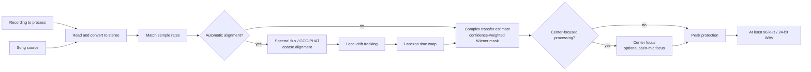

# Reference-Guided Vocal Isolation

  <a href="../reference-removal.md">简体中文</a> · <strong>English</strong>

## Problem Definition

Let the stereo recording to process be $\mathbf{y}(t)$ and the song source be
$\mathbf{x}(t)$. Content that is absent from the song source—such as live vocals, speech, and
ambient sound—is denoted by $\mathbf{v}(t)$. Reference-mask cancellation estimates a complex,
time- and frequency-varying $2\times2K$ transfer matrix in the STFT domain ($K$ frame taps,
default $K=2$):

$$
\mathbf{y}(t) \approx \mathbf{H}(t)\mathbf{x}(t) + \mathbf{v}(t)
$$

The matrix is used only to estimate the source-explained power $P_x(f,n)$. The target power and
linked soft mask are:

$$
\widehat P_v=\max(P_y-C P_x,\,0.05^2P_y),\qquad
M=\sqrt{\frac{\widehat P_v}{P_y+\varepsilon}}
$$

Here, $C$ is the coherence confidence between the mix and the predicted source. Strength
$\alpha\in[0,1]$ continuously controls the processing amount through
$M_\alpha=1-\alpha(1-M)$. The output is always the original mix's complex spectrum multiplied by
a real-valued mask; the source waveform or predicted source spectrum is never subtracted
directly.

Reference cancellation requires the stage/live recording to contain backing audio corresponding
to the selected song source. A different arrangement or key, severe dynamics processing, or
additional instruments cannot be corrected using time and gain adjustments alone.

## Overall Flow

## Time Alignment

### Coarse Alignment

A camera track recorded at the venue may have low waveform correlation with the matching song
source even when note onsets remain similar. The implementation therefore starts with multi-band
spectral-flux features (`shared.dsp.log_flux_bands()`, shared with full-stage matching) and searches
for a significant correlation peak over up to approximately 60 seconds of shared material. A channel
whose bands are too flat rejects the whole estimate; if the feature peak is unreliable, it tries
GCC-PHAT and ordinary cross-correlation in sequence.

GCC-PHAT retains only the phase of the cross-power spectrum:

$$
R_{\mathrm{PHAT}}(\tau)
=\mathcal{F}^{-1}\!\left(
\frac{Y(f)\,\overline{X(f)}}
{\lvert Y(f)\,\overline{X(f)}\rvert+\varepsilon}
\right)
$$

The correlation peak gives the coarse delay. The implementation first searches a smaller range;
if the peak is close to a boundary, it expands the search to at most approximately 20 seconds.
This reduces the chance of meaningless long-distance matches.

### Local Drift

Clock differences between recording devices can produce correct alignment at the beginning but
increasing error toward the end. The implementation resamples the audio into anti-aliased 16 kHz
proxy signals,
estimates local delay every 0.1 seconds, and limits the maximum change between adjacent estimates.
Low-correlation windows retain the predicted value, and a three-point median filter suppresses
jumps.

What limits local delay accuracy is the proxy's *bandwidth*, not its sample grid. Measured end to
end on a drifting broadband reference, raising the proxy rate from 2 kHz to 16 kHz lifted
cancellation depth by roughly 10 dB while alignment runtime stayed flat: the tracking loop still
advances once every 0.1 seconds, only each correlation gets longer. The wider band also admits
more live-only content (vocals, cymbals) into the correlation, but the same sweep improved
monotonically even with a loud live source present, so no cost from that trade was observed.

The delay curve is **deliberately kept on the proxy sample grid**. Refining the peak to
sub-sample resolution with parabolic interpolation was measured to *reduce* cancellation depth: a
constant fractional delay is already absorbed by the per-bin complex transfer as a phase ramp, so
the refinement only adds per-window noise to the lag curve without removing any error the mask
cares about.

After obtaining the delay curve $d(t)$, the source is resampled as

$$
x_{\mathrm{aligned}}(t)=x\bigl(t-d(t)\bigr)
$$

Non-integer positions are interpolated with a radius-3 Lanczos kernel, and the result is written
to mapped storage in blocks. The kernel depends only on the fractional part of the source
position, so it is read from a precomputed 8192-phase table rather than evaluating `sinc` per
output sample; the table's quantisation error sits near -80 dBFS. Sliding window energy in the
local tracker is computed from a prefix sum, which takes it from O(N*M) to O(N).

## Reference-Mask Cancellation

The STFT window targets approximately 46 ms. Its length is rounded to the nearest power of two at
the current sample rate and constrained to 512–4096 points; the hop is one quarter of the window.
At each frequency bin, a complex transfer matrix is estimated from the smoothed source covariance
and mix–source cross-power. Diagonal regularization is added to the covariance, and the total
transfer gain for each output channel is limited to 2×.

The normal equations are $R\,h=c$ with $R_{jk}=\mathbb{E}[x_k\overline{x_j}]$ and
$c_j=\mathbb{E}[y\overline{x_j}]$. **The index order matters**: filling $R_{jk}$ with
$\mathbb{E}[x_j\overline{x_k}]$ transposes the system and solves for a different transfer,
measured at roughly 3.4 dB of cancellation depth on a stereo reference whose channels are
strongly correlated across a small inter-channel delay — the normal case for real backing tracks.
Only the lower triangle is built, and it is solved with an $LDL^{H}$ factorisation vectorised
over whole spectra; stacking each time-frequency cell into a tensor for `numpy.linalg.solve`
makes LAPACK run once per cell and measured about seven times slower.

### Research Basis and Boundaries

- Gorlow, Ramona, and Pachet's [live accompaniment-cancellation study](https://arxiv.org/abs/1611.08905) compares adaptive noise cancellation, spectral subtraction, and short-time ERB-band Wiener filtering. This implementation uses a simpler coherence-weighted frequency-domain soft mask rather than time-domain LMS or a separate ERB voting layer.
- Boll's [classic spectral-subtraction paper](https://doi.org/10.1109/TASSP.1979.1163209) describes magnitude subtraction and residual-noise problems. This implementation retains a subtractive power target while adding reference-conditioned coherence, a mask floor, and narrow time-frequency smoothing instead of directly applying hard spectral subtraction.
- Avery Lee's [Center Cut](https://www.virtualdub.org/blog2/entry_102.html) and ADRess-style methods depend on center imaging, inter-channel level differences, or phase differences. They apply only to the explicit optional center processing below and are not part of this default reference-cancellation optimization.
- The convolutive transfer function (CTF) literature explains why the multiplicative narrowband approximation fails under long reverberation and how a finite set of frame taps replaces it, for example [joint dereverberation and blind source separation with a hybrid CTF model](https://doi.org/10.1016/j.apacoust.2024.110168); `--taps` is the minimal form of that idea. Schröter et al.'s [DeepFilterNet](https://arxiv.org/abs/2110.05588) and Tammen and Doclo's [deep multi-frame MVDR](https://arxiv.org/abs/2011.10345) are the learned form of the same idea: a complex filter across frames per time-frequency bin rather than a point-wise mask.
- Engineering systems with the same structure are useful references. WebRTC's AEC3 is likewise "known reference plus unknown transfer plus double-talk", and its partitioned-block frequency-domain adaptive filter, delay estimation, and residual echo suppressor map onto the alignment, transfer estimation, and coherence-weighted mask here. Enzner and Vary's [frequency-domain adaptive Kalman filter](https://doi.org/10.1016/j.sigpro.2005.09.005) points at replacing the current two-pass robust fit with a state-space model; it is not implemented.

### Approaches Rejected After Measurement

Three textbook refinements were measured on the same synthetic scenes. Each traded live-source fidelity for reverberant depth, and frame taps reach the same depth without paying that, so none were adopted:

- **Convolutive transfer function (CTF) frame taps**, shipped briefly as `--taps` and then removed
  outright. The gain was real on synthetic scenes but confined to short reverberation; retested at
  the venue RT60 this document itself cites, it vanishes or goes slightly negative:

  | Room response | 1 tap | 2 taps | 3 taps |
  |---|---:|---:|---:|
  | 25 ms | 8.70 dB | **11.46** | 9.84 |
  | 60 ms | 4.36 | **9.51** | 8.31 |
  | 250 ms | 1.22 | 3.60 | **4.65** |
  | 500 ms | 1.23 | 1.83 | 2.83 |
  | 1000 ms | 1.58 | 1.47 | 1.76 |
  | 2000 ms | 0.88 | 0.85 | 0.84 |

  The cost was not conditional: four minutes of audio went from 4.8 s to 21.6 s at 44.1 kHz and
  from 14.6 s to 76.2 s at 96 kHz, because the per-block cost multiplies with a reduced parallel
  worker count. The original "venues are reverberant, so enable it by default" call generalised
  from the favourable 60 ms case without testing at the 0.8-2 s a real venue rings. Validate at
  venue scale before retrying this direction.
- Berouti, Schwartz, and Makhoul's SNR-adaptive over-subtraction factor: 60 ms reverb 4.36 to 6.15 dB, but broadband fidelity 0.602 to 0.547 and quiet-vocal fidelity 0.202 to 0.117.
- Ephraim-Malah decision-directed a-priori SNR with a Wiener gain: 60 ms reverb 4.36 to 9.33 dB, but broadband fidelity down to 0.313 and quiet-vocal down to 0.089.
- Breithaupt, Gerkmann, and Martin's [cepstral gain smoothing](https://doi.org/10.1109/LSP.2007.906208): broadband fidelity 0.602 to 0.482, quiet-vocal 0.202 to 0.124.

Also rejected: sub-sample refinement of the local delay (see Local Drift), and replacing `np.abs(z)**2` with `z.real**2 + z.imag**2` in the hot loops. The latter measured slower, because `abs` on complex input is a fused kernel while the hand-written form builds two temporaries.

These papers provide algorithm structure and failure boundaries; they do not guarantee an improvement on every real performance. Matched-segment, loudness-matched A/B listening remains the acceptance criterion.

## Optional Center-Focused Processing

After basic cancellation, **Emphasize live vocals** can be enabled explicitly. The implementation
applies a short-time Fourier transform to the left and right channels, estimates the phantom-center
share from left/right power, cross-spectral coherence, and phase difference, and primarily retains
coherent center content between approximately 80 Hz and 14 kHz.

**Open-mic focus** is effective only when vocal emphasis is enabled. In open-mic or vocal-active
regions with low center confidence, it adds ordinary Mid content instead of restoring the full
left and right channels. Closed-mic and backing-only regions retain Side attenuation. This helps
preserve quiet live vocals without bringing back the entire wide source-derived layer.

Both options alter spatial presentation and are outside the core reference-mask path. Decide
whether to enable them by comparing the same source material through listening.

## Output Protection and Validation

After processing, non-finite values are replaced with finite values and peaks are kept within
range when necessary. Results below 96 kHz are resampled to 96 kHz with high-quality soxr, while
higher original rates are preserved, and output is written as 24-bit PCM WAV. This resampling
standardizes the export format but cannot restore high-frequency detail absent from the input.

Algorithm tests cover time offsets, local drift, inverted polarity, frequency-dependent room
transfer, unrelated sources, rejection of source-only replacement lyrics, matrix crosstalk,
normal-equation orientation on a phase-correlated stereo reference, block seams, center focus, and
open-mic focus. Synthetic metrics only detect implementation
regressions. Real material must still be exported with identical input and settings for direct
comparison, listening closely to vocal level, sibilance, breathing, harmonies, reverb tails, and
audience sound.
