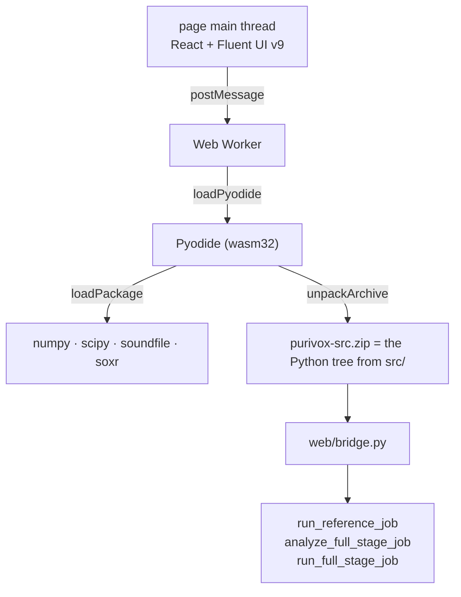

# Browser Build (WebAssembly)

<p align="left">
  <a href="../web.md">简体中文</a> · <strong>English</strong>
</p>

The browser build is Purivox's third shell, alongside the GUI and the CLI. It runs the very same
Python pipelines from `src/` under [Pyodide](https://pyodide.org/). The site is entirely static and
deployed to GitHub Pages, with **no backend**: audio stays in the visitor's own tab from beginning
to end and is never uploaded anywhere.

## What it covers

| Feature | Browser | Why |
|---|---|---|
| Single vocal isolation | ✅ | `run_reference_job` carries no Qt |
| Full stage (matching, timeline, render) | ✅ | `analyze_full_stage_job` / `run_full_stage_job` carry no Qt |
| AI track separation | ❌ | `onnxruntime` has no WebAssembly build of its Python package |

There is one copy of the algorithm. The browser runs the desktop's own `src/features/**`, packed
into `purivox-src.zip` at build time; there is no second TypeScript implementation.

## Structure



- `src/web/bridge.py` is the JavaScript-facing job entry point: **JSON in, JSON out**. Handing a
  dict across would give the page a proxy it must `destroy()` by hand, and a progress callback
  fires often enough that one leaked proxy per update matters.
- `src/web/timeline.py` serialises the timeline. Inserting and removing clips calls
  `add_manual_clip` / `remove_manual_clip` in `features.full_stage.matching` directly, so the page
  edits under the same rules the GUI's `TimelineModel` does.
- `src/web/limits.py` estimates the memory budget; see below.
- `web/` is the Vite + React front end, whose `bun run build` output deploys as-is. It is
  organised by feature, mirroring the Python tree.

## How the front end is laid out

The front end mirrors the Python tree: it is organised by **feature**, not by kind of file.

```text
web/src/
  main.tsx                       entry point
  app/App.tsx                    the shell: navigation, theme, runtime wiring
                                 (the counterpart of src/app/main_window.py)
  features/
    reference_removal/           MrPage.tsx, job.ts
    full_stage/                  FullStagePage.tsx, Timeline.tsx, clock.ts, job.ts
    settings/                    SettingsPage.tsx
  shared/                        depends on neither app nor features
    runtime/                     PurivoxClient, the worker protocol, useClient, useJob, types
    worker/                      the Pyodide worker
    audio/                       the decoder fallback and upload preparation
    i18n/  ui/  jobs.ts  theme.ts
```

The boundaries are the same ones the Python tree has, and they are enforced rather than merely
agreed: `scripts/check-architecture.mjs` parses imports and requires that `shared` import neither
`app` nor `features`, that no feature import another, and that `app` not import the entry point. It
runs alongside `tsc` and Biome under `bun run check`.

The split is visible in the code: the full-stage timeline's `clock.ts` carries milliseconds because
its ranges are editable, while the result card's duration label does not and lives in
`shared/ui/duration.ts`. The desktop divides them the same way - the first is `clock()` in
`full_stage/timeline_model.py`, the second the private `_clock()` in `reference_removal/page.py`.

## Changes made for a build with no Qt and no threads

The one hard Qt dependency on the browser path used to be `shared/i18n.py`, imported at module
scope by `shared/progress.py`, which every pipeline uses through `report_progress`. Now:

- `shared/i18n.py` imports Qt lazily, and `tr()` resolves a key to itself where Qt is absent.
- `ProgressEvent` carries `key` and `values`, so progress reaches the page untranslated and the
  front end renders it from the same `.ts` catalogue. The `.ts` files remain the single authority
  for every string: the desktop compiles them to `.qm` with `pyside6-lrelease`, and the browser
  generates JSON from them with `scripts/build-i18n.mjs`.
- `process_audio` gained an inline schedule. The CPython that Pyodide builds has no pthreads, so
  the pool cannot start a worker. The block layout is unchanged and only the execution differs, so
  both paths produce bit-identical output
  (`tests/features/reference_removal/test_dsp_execution.py`).
- `release_mapped_pages` became best-effort. Emscripten maps a file into the same heap the array
  already occupies, so there is nothing to flush and nothing to evict, and its `msync` reports a
  bad descriptor rather than succeeding.
- `stft` in `shared/dsp/spectral.py` strides straight to the hop positions. Framing every offset
  first and keeping every `hop`-th row made an intermediate view `hop` times taller, and numpy
  refuses a view whose nominal size does not fit a pointer - which under wasm32 is 32 bits, a
  ceiling that a few seconds of 44.1 kHz audio passes. Both formulations give identical results.

## Choices the page makes

**The loading state does not fake a progress bar.** A first visit downloads about 23 MB - the
runtime at 5.7 MB plus numpy 2.8, scipy 13.2, soundfile 0.7 and soxr 0.1, measured compressed
against the pinned build. Pyodide's lock file carries no sizes, so a real byte-level bar is not
available; the page shows coarse progress through the four startup stages and says plainly that the
first visit costs about 23 MB and the browser caches it. Telling the visitor how long they are
waiting beats inventing a percentage. The packages download in one parallel `loadPackage` call:
loading them one at a time would give finer progress but a slower start, and the total is what the
visitor waits for. A failed boot offers a retry rather than requiring a reload.

**Uploads are chunked, so they do have progress.** Files are written into Pyodide's filesystem in
4 MiB slices, which keeps the whole file from ever being resident and gives a song of ordinary
length half a dozen progress steps rather than one.

**Shortcuts live in the app layer, not on a page.** `Ctrl+O` chooses files, `Ctrl+Enter` starts,
`Esc` cancels `F5` finds songs and `Ctrl+P` toggles the preview, matching the desktop - and for the desktop's reason: three
page-local `Ctrl+O` bindings would be an ambiguous overload, and a window shortcut works before a
page has taken focus. While a time range is being edited, `Esc` and `Enter` belong to the input.

**The interface reuses the vocabulary the desktop already settled on.** The home page, the
specific message when an input is missing ("Choose the stage / live audio first." rather than only
greying out Start), the match summary, the empty preview state and the switch's on/off words all
come from keys that have been in the `.ts` catalogues all along and that the browser build simply
was not using. The brand mark is not a redrawing either: `scripts/build-assets.mjs` copies the
desktop's `src/resources/purivox.svg` into the site's favicon and header mark, so there is one
source for it.

**Choosing a file shows what the decoder read** - `02:30 · 48.0 kHz · Stereo · 27 MB`.
`probe_audio` has always returned this and the page never showed it; a wrong sample rate or a
truncated file is now visible before a job runs rather than after, and those are the same numbers
the memory estimate is computed from.

**The preview is a built player, not `<audio controls>`.** The native control looks foreign in a
Fluent interface and different in every browser. It is now play/pause, stop, a draggable seek bar, a
`00:15 / 00:20` label and volume, worded with the desktop's own `preview_play`, `preview_pause`,
`preview_stop`, `preview_volume` and `preview_error`. The behaviour matches too: pressing play at
the end restarts, and `Ctrl+P` toggles playback. The buttons carry their words ("Play", "Stop")
rather than a tooltip: the desktop does the same with `preview_play.setText(...)`, and a Fluent
tooltip pops open on every keyboard focus and covers the card title, which is the last thing a
control meant to be clicked repeatedly should do. The seek bar sets **no step** - Fluent draws a tick
per step, and a step fine enough for audio would bury the rail under thousands of them, while
seeking is continuous anyway. Only one preview plays at a time; starting one pauses the other.

**The working pages are hidden on a tab change, not unmounted.** This fixes a real bug: unmounting
stopped a preview mid-play and threw away both a finished result and a running job, none of which
the visitor asked for by changing tab. The cost is that all pages are mounted at once, so the
shortcut bindings are gated on `active` - otherwise the last page mounted would claim them.

**Responsive behaviour follows the desktop's breakpoints.** Below 620px the file picker stacks its
button above the path, matching the desktop's `PORTRAIT` rule; the tab strip and the timeline table
each scroll sideways on their own, and the page itself never overflows horizontally at 375px. The keyboard hint appears only on a wide screen with a fine pointer - a touch screen has no Ctrl to press.

**There is no code splitting.** The bundle is 560 KB of JavaScript, 160 KB gzipped, which is not
the bottleneck next to 23 MB of Pyodide. Splitting the three pages into async chunks would buy a
saving the visitor cannot perceive, at the cost of another loading state.

## The memory ceiling

wasm32 caps the heap at 4 GB, and Emscripten's temporary filesystem lives inside that same heap.
The `np.memmap` discipline the desktop relies on therefore saves nothing here: every
`create_pcm_audio` allocation is resident, and so is every uploaded file.

`src/web/limits.py` estimates the peak with the formulas below, against a `WASM_BUDGET_BYTES` of
2.6 GB - 4 GB less room for the interpreter, numpy/scipy and allocator fragmentation:

```text
single:  input bytes + song buffer + reference buffer + max(the two) + DSP working set
stage:   input bytes + 2 x stage buffer + 3 x longest source buffer + DSP working set
where:   buffer bytes = channels(2) x sample rate x 4 x seconds
```

A job over the budget is refused outright, pointing at the desktop app; past 60% it warns. At
44.1 kHz stereo that works out at roughly 60 minutes for a stage recording and 30 for a single
song. The formula uses the real sample rate, so 48 kHz and 96 kHz material tightens automatically.

Matching is not affected: `analyze_full_stage` calls `cleanup()` on the stage recording as soon as
it has read it and keeps only the downsampled proxy. The render is the memory-hungry step, because
it holds the stage and a full-length output at the same time.

## Cancellation

Cancelling **terminates the worker and boots a fresh runtime**. Pyodide runs the pipeline
synchronously on the worker's only thread, so busy Python cannot read a message; the cooperative
`CancellationToken` the desktop uses would need a `SharedArrayBuffer`, and GitHub Pages cannot send
the COOP/COEP headers that unlocks.

Terminating takes Emscripten's filesystem with it, so `PurivoxClient` remembers which `File`
objects it uploaded and writes them back to the same paths afterwards. A `File` is a reference to
something the browser already holds on disk, so keeping one costs nothing and spares the user from
picking the same audio again after every cancellation.

## Decoding

The libsndfile that ships inside `soundfile` is compiled with FLAC, Ogg/Vorbis, Opus and MP3, so
the browser reads much the same containers the desktop does. For what libsndfile turns down -
chiefly AAC in an MP4 container - `probe_audio` reports the fact instead of raising, and the page
decodes with the browser's own `decodeAudioData` and hands the pipeline a WAV. This is the same
two-decoder arrangement the desktop makes with libsndfile and Qt Multimedia.

## Running and deploying

```bash
cd web
bun install
bun run dev
```

`predev` and `prebuild` pack `src/` and generate the translation JSON first, so re-run either after
changing Python or a `.ts` catalogue. To check and format:

```bash
cd web && bun run lint      # Biome, recommended rules
cd web && bun run format    # biome check --write
cd web && bun run check     # lint + tsc + the layering check; build runs it first
```

To build:

```bash
cd web && bun run build
```

The output lands in `web/dist/`. Vite's `base` defaults to `/`, since the site is served from the
root of its own domain. To publish it as a GitHub Pages *project* site instead
(`username.github.io/repository/`), override it with `PURIVOX_BASE=/repository/ bun run build`, or
every asset under that subpath will 404. CI builds this in the `web` job of
`.github/workflows/build.yml` and publishes to Pages from `main`.

The Pyodide runtime loads from jsDelivr at the version pinned in `PYODIDE_URL`
(`web/src/runtime/PurivoxClient.ts`) rather than living in the repository: scipy alone is tens of
megabytes, which is not something a Pages repository's size and bandwidth should carry.

## Agreement with the desktop

Given the same inputs and settings, the browser's output differs from `purivox mr` by at most one
least-significant bit of 16-bit quantisation, an RMS difference of about -108 dB. That is
floating-point rounding, not a difference in the algorithm.

Worth knowing: `_processing_workers` derives the block size from `os.cpu_count()`, so the desktop
already produces slightly different output on machines with different core counts. The browser,
which reports a single core, differs in exactly that way and no other.
