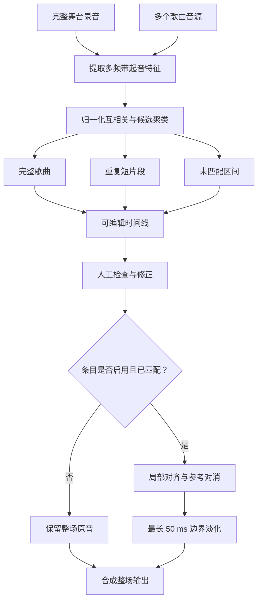

# 完整舞台实现

  <strong>简体中文</strong> · <a href="en/full-stage.md">English</a>

## 目标与边界

完整舞台用于把多个歌曲音源自动放置到一段连续舞台录音中，再只对匹配区间执行参考对消。输入音源无需预先排序，同一音源在片头、广告或片尾短暂重复时也可以形成额外片段。

自动分析不会直接修改音频。它先生成可编辑时间线，用户确认后才渲染；未匹配区间始终从原始整场录音复制。

## 特征提取

整场录音和每个音源会先转成 4 kHz 单声道代理信号，再以约 40 ms 的帧步长计算短时傅里叶变换。幅度经
`log1p` 压缩后取正向谱通量，并聚合为 12 个按几何间隔划分的频带。

对每个频带减去中位数，再以中位绝对幅度归一化并裁剪到 $[-8,8]$。这样匹配更关注起音变化，而不是母带响度。

## 完整歌曲候选

每个音源最多选取 7 个分散锚点。锚点长度按音源时长自适应，范围约为 6～20 秒。每个锚点与整场特征执行归一化互相关：

$$
s(k)=\frac{\langle \mathbf S_k,\mathbf Q\rangle}
{\|\mathbf S_k\|_2\,\|\mathbf Q\|_2+\varepsilon}
$$

锚点命中会换算为“音源第 0 秒在整场中的预测位置”。相差不超过 0.8 秒的命中聚为一个候选，来自不同锚点的票数和平均得分共同形成可信度。候选至少需要多个锚点支持，或拥有足够高的单独得分。

所有音源独立搜索后，候选按票数与置信度排序。每个音源最多选择一个完整歌曲位置，且不会接受与已选歌曲重叠超过 2 秒的候选。最终时间线按舞台开始时间排序。

## 重复短片段

为了识别片头、片尾或广告中的短引用，算法额外以 10 秒窗口、5 秒步长扫描音源，并重点检查整场开头和结尾约
75 秒。候选除了多锚点与置信度门槛，还会回到 4 kHz 波形的一阶差分做二次互相关验证。

短片段至少约 5 秒，并且不能与已识别的完整歌曲或其他片段明显重叠。用户可以在渲染前决定是否包含这些片段。

## 时间线模型

时间线条目分为三类：

| 类型 | 含义 | 默认处理 |
|---|---|---|
| 完整歌曲 | 某个音源的主要完整匹配 | 开启参考对消 |
| 短片段 | 同一音源的局部重复使用 | 可选择是否处理 |
| 未匹配 | 没有可靠音源覆盖的间隔 | 保留原音 |

每个匹配条目同时记录舞台起止时间、音源文件、音源起止时间、置信度和启用状态。模型会拒绝负时间、零长度、无音源的匹配条目以及越界置信度。

识别出的占用区间合并后，长度至少 0.25 秒的空隙会生成未匹配条目。没有识别出的音源会单独列出，便于人工检查。

## 分段渲染

渲染首先创建与整场录音同长度的 24-bit 输出，并完整复制原音。随后逐条处理启用的完整歌曲和可选短片段：

1. 读取并将音源重采样到整场采样率。
2. 按时间线截取整场和音源范围。
3. 可选执行局部漂移对齐。
4. 分别计算原始匹配位置和漂移对齐结果对整场的解释度；只有新结果不更差时才采用漂移对齐。
5. 使用参考掩码对消处理片段；处理只从整场原混音重建，不会把参考波形混入结果。
6. 在片段两端使用最长 50 ms 的淡入淡出，把结果混回整场副本。

解释度通过多个窗口中的小型 $2\times2$ 直接拟合计算残差比例，并取中位数，避免一个异常窗口主导决策。这道选择门用于防止已经正确的时间线位置被不可靠的局部时延轨迹破坏。

## 失败策略

- 没有任何可用匹配时拒绝渲染，而不是生成与输入相同却看似成功的文件。
- 输出不能覆盖整场录音或任一音源，整场录音也不能同时作为参考音源。
- 单个片段的临时音频在处理完成后立即清理，整场输出使用映射文件控制内存占用。
- 用户关闭或没有匹配的区间不会补零、压缩时间线或改变原始长度。
