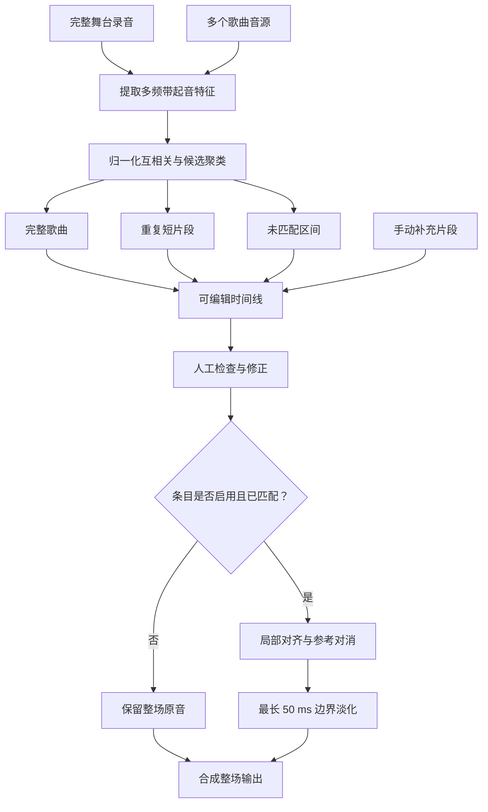

# 完整舞台实现

  <strong>简体中文</strong> · <a href="en/full-stage.md">English</a>

## 目标与边界

完整舞台功能会自动把多个歌曲音源安排到一段连续的舞台录音中，再只对匹配区间执行参考对消。
输入音源无需预先排序；同一音源在片头、广告或片尾短暂重复时，也可以形成额外片段。

自动分析不会直接修改音频。它先生成可编辑的时间线，用户确认后才渲染；未匹配区间始终从原始整场录音
复制。

## 特征提取

整场录音和每个音源会先转成 4 kHz 单声道代理信号，再以约 40 ms 的帧步长计算短时傅里叶变换。幅度经
`log1p` 压缩后取正向谱通量，并聚合为 12 个按几何间隔划分的频带。

对每个频带减去中位数，再以中位绝对幅度归一化并裁剪到 $[-8,8]$。这样匹配更关注起音变化，
而不是母带响度。

该特征由 `shared.dsp.log_flux_bands()` 实现。参考对消的粗对齐需要同一种起音描述，
而两个功能包不得互相导入，因此频带划分、归一化和裁剪只有这一份实现；整场匹配与粗对齐只在窗口长度
和拒绝阈值上不同。

## 完整歌曲候选

每个音源最多选取 7 个分散锚点。锚点长度按音源时长自适应，范围约为 6～20 秒。每个锚点与整场特征执行
归一化互相关：

$$
s(k)=\frac{\langle \mathbf S_k,\mathbf Q\rangle}
{\|\mathbf S_k\|_2\,\|\mathbf Q\|_2+\varepsilon}
$$

锚点命中会换算为“音源第 0 秒在整场中的预测位置”。相差不超过 0.8 秒的命中聚为一个候选，
来自不同锚点的票数和平均得分共同形成可信度。候选至少需要多个锚点支持，或拥有足够高的单独得分。

所有音源独立搜索后，候选按票数与置信度排序。每个音源最多选择一个完整歌曲位置，
且不会接受与已选歌曲重叠超过 2 秒的候选。最终时间线按舞台开始时间排序。

## 重复短片段

为了识别片头、片尾或广告中的短引用，算法额外以 10 秒窗口、5 秒步长扫描音源，
并重点检查整场开头和结尾约 75 秒。候选除了多锚点与置信度阈值，还会回到 4 kHz 波形的一阶差分
做二次互相关验证。

短片段至少约 5 秒，并且不能与已识别的完整歌曲或其他片段明显重叠。用户可以在渲染前决定是否包含这些
片段。

## 时间线模型

时间线条目分为以下几类：

| 类型 | 含义 | 默认处理 |
|---|---|---|
| 完整歌曲 | 某个音源的主要完整匹配 | 开启参考对消 |
| 短片段 | 同一音源的局部重复使用 | 可选择是否处理 |
| 未匹配 | 没有可靠音源覆盖的间隔 | 保留原音 |
| 手动 | 用户自己填入的片段，匹配度列显示“手动” | 与完整歌曲同等处理 |

每个匹配条目同时记录舞台起止时间、音源文件、音源起止时间、置信度和启用状态。
模型会拒绝时间为负、长度为零、缺少音源的匹配条目，以及超出范围的置信度。

识别出的占用区间合并后，长度至少 0.25 秒的空隙会生成未匹配条目。没有识别出的音源会单独列出，便于
人工检查。

界面用 Qt 的模型 / 视图呈现这张表：`features/full_stage/timeline_model.py` 中的
`TimelineModel`（`QAbstractTableModel`）直接以分析结果为唯一数据源，`TableView` 只负责显示。
单元格文本、对齐、勾选状态与可编辑性都由 `data()` 和 `flags()` 决定；用户的修改经 `setData()`
解析和校验后写回分析结果，非法输入返回 `False` 并触发 `edit_rejected`，视图自动恢复原值。
因此不存在“整表重绘”和“屏蔽自身信号”这类代码，切换语言时只需要让模型发出 `dataChanged`。

### 手动片段与拼接垫音

自动分析对每个音源最多给出一个完整歌曲位置，短片段扫描又偏向整场首尾各约 75 秒。**拼接垫音**——
把同一首歌剪成几段、按演出需要重新排序播放——不在这个搜索能构造的结果范围内。

因此时间线支持用“添加片段”手工补行。新行默认落在第一个未识别区间的开头，
随后用可编辑的舞台时间与音源范围两列修正到实际位置。手动片段归为完整歌曲而不是短片段：
渲染时短片段受开关控制，而用户显式
填入的条目不应该被那个开关悄悄跳过。匹配度列显示“手动”，不伪造一个检测置信度。

只有手动片段可以移除；自动识别的条目用取消勾选来跳过，保留在列表里便于复查。

拼接垫音也可以不用全场功能：把音源按演出顺序剪接成对应结构后，当作一首完整曲子跑单曲模式。这样又
变回单一连续对齐问题，但拼接点的误差要控制在几十毫秒内——局部时延跟踪每 0.1 秒最多修正 2 毫秒，
半秒的错位需要约 25 秒才能追回，这段时间里对消是失效的。

## 分段渲染

渲染首先创建与整场录音同长度、同采样率的浮点输出缓冲区，并完整复制原音。随后逐条处理启用的
完整歌曲和可选短片段：

1. 读取并将音源重采样到整场采样率。
2. 按时间线截取整场和音源范围。
3. 可选执行局部漂移对齐。
4. 分别计算原始匹配位置和漂移对齐结果对整场的解释程度；只有新结果不更差时才采用漂移对齐。
5. 使用参考对消处理片段；处理只从整场原混音重建，不会把参考波形混入结果。
6. 在片段两端使用最长 50 ms 的淡入淡出，把结果混回整场副本。

全部片段完成后，低于 96 kHz 的整场结果使用 soxr 高质量重采样到 96 kHz，高于 96 kHz 时保留原采样率，
再原子写出 24-bit PCM WAV。升采样只改变导出规格，不会增加原录音没有的频谱细节。

解释程度通过多个窗口中的小型 $2\times2$ 直接拟合计算残差比例，再取中位数，
避免个别异常窗口左右结论。这个门槛用来防止已经正确的时间线位置被不可靠的局部时延轨迹破坏。

## 失败策略

- 没有任何可用匹配时拒绝渲染，而不是生成与输入相同却看似成功的文件。
- 输出不能覆盖整场录音或任一音源，整场录音也不能同时作为参考音源。
- 单个片段的临时音频在处理完成后立即清理，整场输出使用映射文件控制内存占用。
- 用户关闭或没有匹配的区间不会补零、压缩时间线或改变原始长度。
