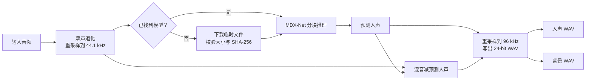

# AI 音轨分离实现

<p align="left">
  <strong>简体中文</strong> · <a href="en/neural-separation.md">English</a>
</p>

## 管线概览

AI 工作流不需要歌曲音源。输入先转为双声道并重采样到 44.1 kHz，然后交给 MDX-Net ONNX 模型预测人声：

$$
\widehat{\mathbf v}=f_{\theta}(\mathbf y)
$$

背景由直接相减得到：

$$
\widehat{\mathbf b}=\mathbf y-\widehat{\mathbf v}
$$

模型计算仍保持 44.1 kHz。完成后，人声与背景分别使用 soxr 高质量重采样到 96 kHz，最终写出 `<歌曲名>_vocal.wav` 与 `<歌曲名>_background.wav` 两个 24-bit 双声道 WAV。



## 模型目录与下载

模型按以下顺序查找：

1. 任务参数 `--models-dir` 指定的目录；
2. `PURIVOX_MODELS` 环境变量；
3. 系统应用数据目录中的 `models/`；
4. 开发仓库根目录的 `models/`。

若没有找到权重，程序从 TRvlvr 的公开 UVR 模型发布页下载到显式目录或系统应用数据目录。下载走 Qt 网络栈：
`QNetworkAccessManager` 负责请求，因此自动沿用系统代理设置、跟随发布页到存储主机的安全跳转，并对停滞的
传输施加 120 秒超时；进度来自 `downloadProgress` 信号，取消由定时轮询触发 `abort()`。

写入使用 `QSaveFile`：数据落在目标同目录的临时文件里，SHA-256 随写入增量计算，只有文件大小与摘要都与目录
登记值一致才 `commit()` 原子改名。任何失败、校验不符或取消都调用 `cancelWriting()`，磁盘上不会留下半成品，
也不存在"看起来存在、其实损坏"的模型文件。

AI 页面用 `QFileSystemWatcher` 监视上述搜索目录，权重下载完成或被手工放入时，"需要下载 / 已就绪"标识
会立即更新，不需要重新进入页面。

当前目录提供 4 个模型定义：

| 模型标识 | 显示名称 | 权重文件 |
|---|---|---|
| `mdxnet_1` | UVR-MDX-NET 1 | `UVR_MDXNET_1_9703.onnx` |
| `mdxnet_main` | UVR-MDX-NET Main | `UVR_MDXNET_Main.onnx` |
| `kim_vocal` | Kim Vocal 1 | `Kim_Vocal_1.onnx` |
| `kuielab_b` | kuielab B Vocals | `kuielab_b_vocals.onnx` |

模型权重不进入 wheel、源码包或独立程序。

## 模型规格

程序以模型文件 MD5 查询 `src/resources/model_data.json`，读取 FFT 尺寸、频率维度、时间维度、补偿系数和主干名称。4 个内置模型的准确摘要均登记在该表中；没有对应记录的模型会被拒绝。

ONNX 输入应为四维张量：

```text
[批次, 4, 频率维度, 时间维度]
```

其中 4 个平面依次为左声道实部、左声道虚部、右声道实部和右声道虚部。固定维度必须与模型规格一致；批次维可以是模型导出的符号维度。ONNX Runtime 当前使用 CPU 执行提供程序。

## 频谱变换与分块

每个声道执行短时傅里叶变换，截取模型需要的频率范围并组装为输入张量。最低三个频率格被清零，以符合 MDX-Net 推理流程。模型输出的实部与虚部重新组合为复频谱，补齐未预测的高频格后通过逆变换恢复波形。

长音频按模型的 `hop`、`segment_size` 和 `n_fft` 计算分块大小。相邻预测块使用汉宁窗加权重叠相加：

$$
\widehat y[n]=\frac{\sum_k w_k[n]\,\widehat y_k[n]}
{\max\left(\sum_k w_k[n],\varepsilon\right)}
$$

分母单独保存在临时映射音频中，避免块重叠处响度变化。合并后再应用模型规格中的补偿系数。

## 资源与质量边界

- 推理输入、输出和重叠分母均使用 `float32`；长音频输出存入映射文件。
- 推理循环和最终归一化循环都响应协作式取消。
- 所有模型共享同一处理管线，但训练目标和音色偏好不同；模型名称不代表对所有素材的固定排名。
- 背景是“原混音减预测人声”，并非第二个独立模型输出，因此人声预测误差会直接反映在背景中。
- 96 kHz、24-bit 是导出文件规格；模型推理仍为 44.1 kHz，升采样不会生成模型没有预测出的高频细节。
