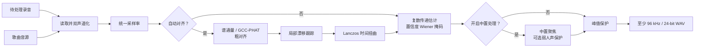

# 参考引导人声提取实现

  <strong>简体中文</strong> · <a href="en/reference-removal.md">English</a>

## 问题定义

设待处理的双声道录音为 $\mathbf{y}(t)$，歌曲音源为 $\mathbf{x}(t)$，现场人声、讲话和环境声等音源中不存在的内容为
$\mathbf{v}(t)$。参考掩码对消在 STFT 域估计随时间和频率变化的复数 $2\times2$ 传递矩阵：

$$
\mathbf{y}(t) \approx \mathbf{H}(t)\mathbf{x}(t) + \mathbf{v}(t)
$$

该矩阵只用于估计歌曲音源能够解释的垫音功率 $P_x(f,n)$。目标功率和联动软掩码为：

$$
\widehat P_v=\max(P_y-C P_x,\,0.05^2P_y),\qquad
M=\sqrt{\frac{\widehat P_v}{P_y+\varepsilon}}
$$

其中 $C$ 是混音与预测参考的相干置信度。强度 $\alpha\in[0,1]$ 通过
$M_\alpha=1-\alpha(1-M)$ 连续控制处理量，输出始终是原混音复频谱乘以实数掩码；不会把参考波形或预测参考复频谱直接相减。

参考对消成立的前提是舞台 / 现场音频中包含与歌曲音源对应的垫音内容。不同编曲、升降调、严重动态处理或额外乐器无法仅靠时间和增益校正解决。

## 总体流程

## 时间对齐

### 粗对齐

现场相机音轨与歌曲音源可能波形相关性很低，但音符起音位置仍相近。因此实现优先提取多频带谱通量特征，在最多约
60 秒的公共范围内寻找显著相关峰。若特征峰不可靠，再依次尝试 GCC-PHAT 与普通互相关。

GCC-PHAT 对互功率谱只保留相位：

$$
R_{\mathrm{PHAT}}(\tau)
=\mathcal{F}^{-1}\!\left(
\frac{Y(f)\,\overline{X(f)}}
{\lvert Y(f)\,\overline{X(f)}\rvert+\varepsilon}
\right)
$$

相关峰对应粗略时延。默认先在较小范围搜索，峰落在边界附近时再扩大到最多约 20 秒，降低无意义远距离匹配的概率。

### 局部漂移

不同录音设备的时钟误差会使起点正确、结尾逐渐错位。实现把音频降采样为代理信号，每 0.1 秒估计一次局部时延，并限制相邻估计的最大变化。低相关窗口沿用预测值，最后使用三点中值滤波抑制跳变。

得到时延曲线 $d(t)$ 后，参考信号按

$$
x_{\mathrm{aligned}}(t)=x\bigl(t-d(t)\bigr)
$$

重采样。非整数位置由半径为 3 的 Lanczos 核插值，过程按块写入映射文件。

## 参考掩码对消

STFT 窗口目标约 46 ms，并按采样率取最接近的 2 次幂，限制在 512～4096 点；帧移为窗口的四分之一。每个频点根据平滑的参考协方差和混合—参考互功率估计复数传递矩阵。协方差加入对角正则，每个输出声道的总传递增益限制为 2 倍。

算法先拟合一次，根据预测残差降低人声、欢呼和异常瞬态的权重，再执行一次加权拟合。图形界面固定使用兼顾适应速度和稳定性的 3 秒统计上下文，避免要求用户判断难以直接预估的底层参数；命令行仍可通过 `--sigma` 选择 1、3、8 或 16 秒，用于诊断特殊素材。

预测参考只参与功率估计。算法同时计算约 120 ms 的短时相干度和由 `sigma` 决定的长时相干度：只有短时匹配与长期稳定性共同成立时，才提高参考置信度。随后按约一个 ERB 的听觉频带、以预测参考功率加权稳定置信度，抑制孤立频点闪烁而不把宽频带衰减直接施加到人声上。目标功率按 80% 历史值和 20% 当前值更新，进一步减少音乐噪声。混音中新出现、但预测参考没有对应变化的正向谱通量会抬高掩码，以保护辅音、呼吸、欢呼和其他非参考瞬态。左右声道共用功率加权掩码，因此不会因独立声道门控导致声像跳动。

静音或无关参考会得到低置信度并接近直通；强度为 0 时完全跳过 STFT，逐样本复制输入。

整段音频按 `sigma` 使用 12～28 秒处理块，避免较短统计上下文仍占用固定 30 秒复频谱内存。相邻块至少重叠 2 秒，并随 `sigma` 增加到半个统计上下文、最高不超过块长的三分之一，再使用余弦平方与正弦平方权重交叉淡化：

$$
w_{\mathrm{old}}(\theta)=\cos^2\theta,\qquad
w_{\mathrm{new}}(\theta)=\sin^2\theta
$$

两者之和恒为 1，可降低块边界接缝。

### 研究依据与边界

- Gorlow、Ramona 与 Pachet 的[现场独奏伴奏消除研究](https://arxiv.org/abs/1611.08905)比较了自适应噪声消除、频谱减法和短时 ERB 子带 Wiener 滤波；本文实现据此采用短时频域软掩码和 ERB 置信度稳定，不改用时域 LMS。
- Boll 的[经典谱减法论文](https://doi.org/10.1109/TASSP.1979.1163209)说明了幅度谱减和残留噪声问题；本实现保留谱减式功率目标，但使用参考条件相干度、掩码下限和瞬态保护，避免直接硬减频谱。
- Avery Lee 的 [Center Cut](https://www.virtualdub.org/blog2/entry_102.html) 以及 ADRess 一类方法依赖中心声像、通道电平差或相位差。它们只对应下方显式可选的中置处理，不参与本次默认参考对消核心优化。

这些论文提供算法结构和失败边界，并不保证某段真实演出一定改善；最终判断仍是相同片段、相同响度下的 A/B 试听。

## 可选中置处理

基础对消完成后，可显式开启“中置人声提取”。实现对左右声道执行短时傅里叶变换，根据左右功率、互谱相干性和相位差估计幻象中置占比，并主要保留约 80 Hz～14 kHz 的相干中置内容。

“弱人声保护”只在中置人声提取开启时有效。当中置置信度不足时，它回退到普通 Mid 内容，而不是恢复完整左右声道，从而尽量保护弱人声而不带回整层宽声场垫音。

这两个选项都会改变空间感，不属于参考掩码核心路径。是否启用应通过同一素材的试听对比决定。

## 输出保护与验证

处理结束后会把非有限值替换为有限数，并在需要时避免峰值越界。低于 96 kHz 的结果使用 soxr 高质量重采样到 96 kHz，高于 96 kHz 时保留原采样率，最终输出 24-bit PCM WAV。该升采样只统一导出规格，不会恢复输入中不存在的高频细节。

算法测试覆盖时间偏移、局部漂移、反极性、频率相关房间传递、无关参考、参考独有改词否决、矩阵串扰、块接缝、中置聚焦和弱人声保护。合成信号指标只用于发现实现回归；真实素材仍需以相同输入和参数导出对照版本，重点听人声大小、齿音、呼吸、和声、混响尾音与观众声是否自然。
