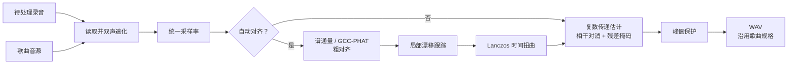

# 参考引导人声提取实现

  <strong>简体中文</strong> · <a href="en/reference-removal.md">English</a>

## 问题定义

设待处理的双声道录音为 $\mathbf{y}(t)$，歌曲音源为 $\mathbf{x}(t)$，现场人声、讲话和环境声等音源中
不存在的内容为 $\mathbf{v}(t)$。参考对消在 STFT 域估计随时间和频率变化的复数 $2\times2$ 传递矩阵：

$$
\mathbf{y}(t) \approx \mathbf{H}(t)\mathbf{x}(t) + \mathbf{v}(t)
$$

对消分两级，结构与声学回声消除一致：先用复数减法把预测出的垫音成分从混音中去掉，
再用软掩码抑制线性级未能干净描述的残余。记预测为 $\mathbf{d}=\mathbf{H}\mathbf{x}$，第一级是

$$
\mathbf{e}=\mathbf{y}-\gamma\,\mathbf{d},\qquad
\lvert\mathbf{e}\rvert\leftarrow\min\bigl(\lvert\mathbf{e}\rvert,\lvert\mathbf{y}\rvert\bigr)
$$

第二式把线性级约束为只能减少能量，不会凭空增加。残余里仍然留有窗外混响、残余失配这类传递函数
描述不了的垫音，其大小按逐频点的泄漏比 $\rho(f)$ 估计，再交给联动软掩码去除：

$$
\widehat P_v=\max(P_e-\beta\rho P_d,\,0.05^2P_e),\qquad
M=\sqrt{\frac{\widehat P_v}{P_e+\varepsilon}}
$$

强度 $\alpha\in[0,1]$ 在复频谱上线性插值：

$$
\mathbf{s}=\mathbf{y}+\alpha\,(M\mathbf{e}-\mathbf{y})
$$

不执行相减时 $\mathbf{e}=\mathbf{y}$，上式化为 $M_\alpha=1-\alpha(1-M)$，也就是原来的纯掩码路径；
因此 $\alpha=0$ 仍然表示完全不做处理，$\alpha$ 仍然单调。

相减之所以安全，是因为逐频点的最小二乘预测本身就是 $\mathbf{y}$ 在
$\mathrm{span}(\mathbf{x})$ 上的投影。参考里有而混音里没有的内容，例如改过的歌词或音源独有的和声，
满足 $\mathbb{E}[y\overline{x_j}]\approx 0$，于是 $h$ 和 $d$ 都趋近于零，这类内容根本不会被预测出来，
也就无从注入。$\gamma$ 在这些位置同样趋于零，再加上上面的不放大约束，这三重保护彼此独立。
项目早期有一条被移除的 direct residual 路径，它在时域上减去全带的实数矩阵，
既没有逐频点的投影，也没有置信度和输出上界，所以会把参考独有的内容反相注入输出。

参考对消成立的前提，是舞台 / 现场音频中包含与歌曲音源对应的垫音内容。编曲不同、升降调、明显的动态
处理或额外乐器，都难以仅靠时间和增益校正解决。

## 总体流程

## 时间对齐

### 粗对齐

现场相机音轨与歌曲音源可能波形相关性很低，但音符起音位置仍相近。因此实现优先提取多频带谱通量特征
（`shared.dsp.log_flux_bands()`，与完整舞台匹配共用），在最多约 60 秒的公共范围内寻找显著相关峰。
若某个声道的频带过于平坦，整个估计会被放弃；若特征峰不可靠，再依次尝试 GCC-PHAT 与普通互相关。

GCC-PHAT 对互功率谱只保留相位：

$$
R_{\mathrm{PHAT}}(\tau)
=\mathcal{F}^{-1}\!\left(
\frac{Y(f)\,\overline{X(f)}}
{\lvert Y(f)\,\overline{X(f)}\rvert+\varepsilon}
\right)
$$

相关峰对应粗略时延。默认先在较小范围搜索，峰落在边界附近时再扩大到最多约 20 秒，降低无意义远距离
匹配的概率。

### 局部漂移

不同录音设备的时钟误差会使起点正确、结尾逐渐错位。实现把音频重采样为 16 kHz 的抗混叠代理信号，
每 0.1 秒估计一次局部时延，并限制相邻估计的最大变化。低相关窗口沿用预测值，最后使用三点中值滤波抑制
跳变。

决定局部时延精度的是代理信号的**带宽**而不是它的采样格。在一段带漂移的宽带参考上端到端测量，代理
采样率从 2 kHz 提高到 16 kHz 使对消深度上升约 10 dB，而对齐耗时基本不变——跟踪循环仍然每 0.1 秒
推进一格，每格的相关只是变长。更高的带宽也会把更多“只在现场出现”的内容（人声、镲片）纳入相关计算；
同一组测量在存在很大现场声源时仍然单调改善，因此没有观察到这个取舍带来的损失。

时延曲线**刻意保持在代理采样格上**。把峰值用抛物线插值精化到亚采样分辨率经测量反而降低对消深度：
恒定的小数延迟已经被逐频点的复数传递当作相位斜坡吸收，精化只是给时延曲线增加逐窗噪声，并不去掉
掩码真正在意的误差。

得到时延曲线 $d(t)$ 后，参考信号按

$$
x_{\mathrm{aligned}}(t)=x\bigl(t-d(t)\bigr)
$$

重采样。非整数位置由半径为 3 的 Lanczos 核插值，过程按块写入映射文件。核只依赖源位置的小数部分，
因此改为查 8192 个相位的预计算表，避免对每个输出样本重复求 `sinc`；表的量化误差约在 −80 dBFS。
局部跟踪窗口的滑动能量用前缀和计算，从 O(N·M) 降为 O(N)。

## 相干对消

STFT 窗口目标约 46 ms，并按采样率取最接近的 2 次幂，限制在 512～4096 点；帧移为窗口的四分之一。
每个频点根据平滑的参考协方差和混音与参考的互功率估计复数传递矩阵。协方差加入对角正则，
每个输出声道的总传递增益限制为 2 倍。

正规方程为 $R\,h=c$，其中 $R_{jk}=\mathbb{E}[x_k\overline{x_j}]$、$c_j=\mathbb{E}[y\overline{x_j}]$。
**下标顺序不能写反**：把 $R_{jk}$ 填成 $\mathbb{E}[x_j\overline{x_k}]$ 会转置整个方程组并解出另一个
传递，在左右声道强相关且带小的声道间时延时（真实立体声垫音的常态）实测损失约 3.4 dB 对消深度。实现
只构造下三角，并用逐频谱向量化的 $LDL^{H}$ 分解求解；把每个时频单元堆成张量交给
`numpy.linalg.solve` 会让 LAPACK 逐单元调用，实测慢约 7 倍。

### 传递估计的可靠性

相减多少取决于传递估计有多可信，所以这个可信度最好不是事后另算的量。在最小二乘最优点上
$\mathbb{E}[|Hx|^2]=h^{H}c$，参考究竟解释了混音多少，可以直接从求解结果里读出来：

$$
\gamma^2=\frac{\mathrm{Re}\,(h^{H}c)}{P_y+\varepsilon}
$$

这个多重相干在解方程时顺带就有了。早先的实现是在混音与预测之间另算一次互谱相干，
每个声道要多做三次平滑，而且没有扣掉下面这项偏置。

有限窗口上的最小二乘总会碰巧解释掉一部分混音，期望大小恰好是 $p/N_{\text{eff}}$，其中 $p$ 是阶数。
把它扣掉就得到调整后的相干：

$$
N_{\text{eff}}=\max\Bigl(W\cdot\tfrac{\text{hop}}{n_{\text{fft}}}\cdot 1.5,\;p+2\Bigr),\qquad
\gamma^2_{\text{adj}}=1-(1-\gamma^2)\frac{N_{\text{eff}}}{N_{\text{eff}}-p}
$$

其中 $W$ 是平滑窗的帧数，$\text{hop}/n_{\text{fft}}=1/4$ 是 75% 重叠下相邻帧的等效独立度，1.5 是
频率轴 $\sigma=1$ 高斯的等效独立频点数。这项修正的效果可以直接测出来：面对一段完全无关的参考，
扣掉偏置后程序会精确地保持原样（相关系数 1.000000、RMSE 为 0）；不扣则退化到 RMSE 0.00236，虽然
仍在 0.01 的阈值以内，但差了一个数量级。“无关的音源不该被减掉”这条性质正来自这项修正。

代入之前，$W$ 还要先按本块实际拥有的帧数截断。盒滤波在块边界是反射而不是凭空生成样本，
比整块还宽的统计窗只值这个块所拥有的帧数；照标称宽度读会高估观测数，而且恰好高估在过拟合最严重的
短块上。

传递的估计误差方差约为未解释功率的 $p/N_{\text{eff}}$ 倍，使均方误差最小的收缩量也就随之确定：

$$
\gamma=\frac{\gamma^2_{\text{adj}}}{\gamma^2_{\text{adj}}+\frac{p}{N_{\text{eff}}}\bigl(1-\gamma^2_{\text{adj}}\bigr)+\varepsilon}
$$

参考什么都解释不了时 $\gamma$ 为零，完全不减；解释得越充分，越接近把预测全额减掉。

对角正则同样需要一个下限。只按局部参考功率按比例添加时，正则项会随着功率一起衰减：当某个频点的
参考瞬时静音而混音没有静音时，方程几乎无据可解，传递会一路放大，直到增益上限才被拦住。因此正则
不会低于该频点按自身中位数电平计算出来的量。

判断离群值所用的尺度也不能被离群值自己抬起来。平滑后的算术均值会被它本该抑制的人声瞬态拉高，改用
几何均值就没有这个问题，仍然是同一个 O(N) 平滑器，只是在对数域上读。

线性级之后剩下的相关成分主要是窗外的混响尾巴和残余失配，其大小按逐频点的泄漏比 $\rho(f)$ 估计，
统计范围限定在参考主导的帧上——现场录音在乐句之间提供了大量这样的帧。

### 非相干功率通道

在真实素材上，失效模式并不是混响，而是相位关系整体消失。以一段 KWDA 舞台录音为例：对齐本身是
亚采样准确的（残余时延 0.00～0.04 ms），结构和速度也吻合（帧能量包络相关 0.896），但复数多重相干
在 0～100 Hz 尚有 0.68，500 Hz 以上就只剩 0.02～0.05。把分析窗从 43 ms 一路加长到 1365 ms，足足
32 倍，可减深度也只从 2.30 dB 抬到 4.24 dB，说明这不是“窗比混响短”能解释的。

不过同一段素材的幅度仍然相关，对数幅度谱逐带相关在 0.45～0.72 之间。因此在复数通道之外还并行做
一路功率域回归：

$$
P_y \approx g(f,n)\,P_x + c(f,n)
$$

回归保留截距是有意的：$gP_x$ 是跟随音源变化的部分，缓变的 $c$ 是现场内容，只有前者允许被去除。
斜率约束为非负——音源里的伴奏更多，舞台上的量不可能反而更少——再按同样的自由度修正得到调整后的
相关，并用 smoothstep 设置阈值。无关素材的响度包络本身就有一定相关，
这道阈值就是“无关的音源不该被压制”的保障。

掩码最终去除的是两条通道中解释得更多的那一个，并扣除相干级已经减掉的部分。在这段舞台录音上，去除量
实测从 3.29 dB 提高到 6.85 dB，代价是在相干通道原本就表现良好的合成场景上损失约 0.3～0.6 dB 深度
和 0.03 保真度——相当于用干净素材上的余量，换难处理素材的可用性。

这条通道的收益是有代价的：它去除的是功率上跟随音源的内容，而不是波形上确实来自音源的内容，
判断依据比相干通道弱得多。早期版本让这一路直接驱动掩码，掩码随弱证据逐格开合，在强相位失配的素材上
试听后可以听出音乐噪声——垫音消得干净，音质却有可感知的下降。现在的实现用两道约束压制这个噪声源：

- 单个时频格里非相干扣除最多只能吃掉一部分残余功率（`_INCOHERENT_MAX_SHARE`），弱证据再吵也
  不能把掩码压到地板；
- 掩码比值改为先对分子、分母做时间域功率平滑（`_MASK_POWER_SMOOTH`）再相除，把逐格起伏在进入
  掩码之前摊平，最后仍保留原有的窄高斯平滑。

代价是相位失配素材上让出约 0.2 dB 深度（合成场景 1.34 → 1.14 dB），换取掩码起伏的大幅下降。
当 $gamma^2$ 在 500 Hz 以上只有 0.02～0.05 时，用来判断“这一格究竟是不是垫音”的信息本身就不够，
因此该路径在低置信区间仍然会被 smoothstep 门槛关闭；其余可调参数为
`_INCOHERENT_OVERSUBTRACTION`、`_MASK_FLOOR` 和 `_MASK_SMOOTHING`。

### 研究依据与边界

- Gorlow、Ramona 与 Pachet 的[现场独奏伴奏消除研究](https://arxiv.org/abs/1611.08905)比较了自适应噪声消除、频谱减法和短时 ERB 子带 Wiener 滤波；本文实现采用频域复数相减加相干度加权软掩码，不改用时域 LMS，也不保留独立 ERB 投票层。
- Boll 的[经典谱减法论文](https://doi.org/10.1109/TASSP.1979.1163209)说明了幅度谱减和残留噪声问题；本实现保留谱减式功率目标，但作用在复数相减之后的残差上，并使用逐频点泄漏比、掩码下限和窄时频平滑，避免直接硬减频谱。
- Avery Lee 的 [Center Cut](https://www.virtualdub.org/blog2/entry_102.html) 以及 ADRess 一类方法依赖中心声像、通道电平差或相位差，与本实现无关：它们只看左右两个声道的空间关系，而参考对消看的是歌曲音源提供的证据。项目曾以可选开关的形式提供过这样一层中置处理，实测后整体移除——它对相位被破坏的现场录音会直接压掉人声，留下的却是混响和观众声。
- 卷积传递函数（CTF）文献说明了乘性窄带近似在长混响下失效，以及用有限个跨帧抽头替代它的做法，例如[混合 CTF 模型的联合去混响与盲分离](https://doi.org/10.1016/j.apacoust.2024.110168)。该思路曾以跨帧抽头的形式实现，实测后整体移除，原因见下。Schröter 等人的 [DeepFilterNet](https://arxiv.org/abs/2110.05588) 以及 Tammen 与 Doclo 的[深度多帧 MVDR](https://arxiv.org/abs/2011.10345) 是同一思想的学习型形态：为每个时频点估计跨帧复数滤波器，而不是逐点掩码。
- 结构相同的工程实现可作对照：WebRTC 的 AEC3 同样是“已知参考 + 未知传递 + 双讲干扰”，其延迟估计、线性回声对消与残余回声抑制逐级对应本文的对齐、复数相减与残差软掩码；本实现按块批量最小二乘求解，因此不像 AEC3 那样跨块递推，块之间可以并行。Enzner 与 Vary 的[频域自适应卡尔曼滤波](https://doi.org/10.1016/j.sigpro.2005.09.005)给出了用状态空间模型替代当前“拟合 → 降权 → 重拟合”两遍鲁棒估计的方向，尚未实现。

### 相干对消的实测收益

把纯掩码路径换成复数相减加残差掩码之后，合成场景上的对消深度与人声保真度是同时提升的，不像以往几次
尝试那样要拿保真度去换深度。下面是 `tools/eval_cancellation.py` 在 strength = 1.0、sigma = 3 下的
实测结果：

| 场景 | 深度（旧 → 新） | 保真度（旧 → 新） | 现场源增益（旧 → 新） |
|---|---|---|---|
| 房间 25 ms | 7.16 → **10.13** dB | 0.926 → **0.963** | 0.882 → **0.914** |
| 房间 60 ms | 5.73 → **8.28** dB | 0.930 → **0.962** | 0.910 → **0.950** |
| 房间 250 ms | 4.25 → **4.91** dB | 0.883 → **0.899** | 0.942 → **0.957** |
| 房间 1000 ms | 3.81 → **4.08** dB | 0.873 → **0.881** | 0.962 → **0.970** |
| 房间 2000 ms | 3.05 → **3.27** dB | 0.881 → **0.888** | 0.971 → **0.980** |
| 宽声场伴奏 + 弱人声 | 19.04 → **24.82** dB | 0.962 → **0.990** | 0.958 → **0.961** |
| 走速漂移 1% | 6.06 → **6.75** dB | 0.905 → **0.919** | 0.963 → **0.974** |
| 相位相关立体声参考 | 12.59 → **17.60** dB | 0.693 → **0.887** | 0.461 → **0.518** |
| 参考独有改词 | 25.38 → **46.13** dB | 注入量仍为 0.0001 | — |

三个指标同时改善，没有一项退化，这是以往几次尝试都没有做到的。运行时间上，四分钟素材由 5.18 s 降到
4.77 s（44.1 kHz）、12.95 s 升到 13.50 s（96 kHz），新增的一级相减被省去的事后相干平滑完全抵消，
还有富余。

随后又加入了上一节的两项掩码起伏约束。同一组合成场景上，与加入前的版本相比：房间 25 ms 深度
+0.89 dB、保真度 +0.009；相位相关立体声参考深度 +2.14 dB、保真度 +0.083、现场源增益 +0.129；
走速漂移 1% 深度 −0.04 dB，基本持平；无关参考旁通保持精确。评测集新增
`phase_decorrelated_stage` 场景，专门守护非相干通道——禁用该通道后它的深度会跌向零，其余场景
几乎不动，这正是该通道存在的理由。

长混响一端的收益明显更小，2000 ms 只有 0.23 dB。乘性窄带模型在那里本来就描述不了垫音，相减无从
下手，多出来的那一点来自残差掩码按泄漏比的处理，这与跨帧抽头当年的失败边界一致。

$N_{\text{eff}}$ 里的帧独立度是实测定下来的，不是推导出来的。按 $\text{hop}/n_{\text{fft}}$ 直接取
$1/4$ 时，最受保护的弱人声场景现场源增益比旧掩码路径低 1.7%；取 $1/8$ 则反而高出 0.3%，代价是
60 ms 处的深度收益从 3.12 dB 降到 2.55 dB。Hann 窗在重叠帧之间本身就有相关性，频率高斯在四频点
主瓣下的等效独立频点数也比标称的少，两者都让直接取 $1/4$ 显得过于乐观。

### 测量后被否决的做法

以下三种教科书式改法都在同一组合成场景上实测过，结果都是**用现场人声保真度换混响深度**；而跨帧抽头
可以在不付出这个代价的前提下达到同样的深度，因此都没有采用：

- **跨帧卷积传递（CTF）抽头**，曾以 `--taps` 选项加入，后又整体移除。合成场景上它确实有效，但只限于
  短混响；按本文档自己引用的真实场馆 RT60 重测后，收益消失甚至转负：

  | 房间响应 | 1 抽头 | 2 抽头 | 3 抽头 |
  |---|---:|---:|---:|
  | 25 ms | 8.70 dB | **11.46** | 9.84 |
  | 60 ms | 4.36 | **9.51** | 8.31 |
  | 250 ms | 1.22 | 3.60 | **4.65** |
  | 500 ms | 1.23 | 1.83 | 2.83 |
  | 1000 ms | 1.58 | 1.47 | 1.76 |
  | 2000 ms | 0.88 | 0.85 | 0.84 |

  代价却是实打实的：四分钟素材从 4.8 秒涨到 21.6 秒（44.1 kHz）、14.6 秒涨到 76.2 秒（96 kHz），
  因为逐块成本变高，同时并行线程数减少，两者叠加。最初“场馆有混响所以默认开启”的判断，错在只用
  60 ms 这一有利场景外推，没有在 0.8～2 秒的真实混响上验证。若要重试这条路，先在场馆尺度上验证。
- Berouti、Schwartz 与 Makhoul 的信噪比自适应过减因子：60 ms 混响 4.36→6.15 dB，但宽带场景保真度 0.602→0.547，弱人声场景 0.202→0.117。
- Ephraim–Malah 判决引导先验信噪比加 Wiener 增益：60 ms 混响 4.36→9.33 dB，但宽带保真度降到 0.313，弱人声降到 0.089。
- Breithaupt、Gerkmann 与 Martin 的[倒谱域增益平滑](https://doi.org/10.1109/LSP.2007.906208)：宽带保真度 0.602→0.482，弱人声 0.202→0.124。

同样被否决的还有对局部时延做亚采样精化（见“局部漂移”），以及把热点里的 `np.abs(z)**2` 换成
`z.real**2 + z.imag**2`——后者实测更慢，因为 `abs` 在复数上是融合内核，而手写形式要生成两个临时数组。

这些论文提供的是算法结构和失败边界，并不保证某一段真实演出一定会改善；最终的判断标准仍是相同片段、
相同响度下的 A/B 试听。

## 输出保护与验证

处理结束后会把非有限值替换为有限数，并在需要时限制峰值以防越界。结果直接按歌曲自身的采样率与位深写出
PCM WAV：对消不改变时间轴，也不产生新的频谱，把导出规格抬到固定下限只会让文件变大。

算法测试覆盖时间偏移、局部漂移、反极性、频率相关房间传递、无关参考、参考独有改词否决、矩阵串扰、
正规方程取向（相位相关的立体声参考）和块接缝。`tools/eval_cancellation.py` 另外
提供离线 A/B 评测，按场景报告对消深度与保真度，供改动前后对照。合成信号指标只用于发现实现回归；
真实素材仍需以相同输入和参数导出对照版本，重点听人声大小、齿音、呼吸、和声、混响尾音与观众声
是否自然。
