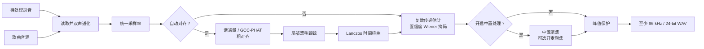

# 参考引导人声提取实现

  <strong>简体中文</strong> · <a href="en/reference-removal.md">English</a>

## 问题定义

设待处理的双声道录音为 $\mathbf{y}(t)$，歌曲音源为 $\mathbf{x}(t)$，现场人声、讲话和环境声等音源中不存在的内容为
$\mathbf{v}(t)$。参考掩码对消在 STFT 域估计随时间和频率变化的复数 $2\times2$ 传递矩阵：

$$
\mathbf{y}(t) \approx \mathbf{H}(t)\mathbf{x}(t) + \mathbf{v}(t)
$$

该矩阵只用于估计歌曲音源能够解释的垫音功率 $P_x(f,n)$。目标功率和联动软掩码为：

$$
\widehat P_v=\max(P_y-C P_x,\,0.05^2P_y),\qquad
M=\sqrt{\frac{\widehat P_v}{P_y+\varepsilon}}
$$

其中 $C$ 是混音与预测参考的相干置信度。强度 $\alpha\in[0,1]$ 通过
$M_\alpha=1-\alpha(1-M)$ 连续控制处理量，输出始终是原混音复频谱乘以实数掩码；不会把参考波形或预测参考复频谱直接相减。

参考对消成立的前提是舞台 / 现场音频中包含与歌曲音源对应的垫音内容。不同编曲、升降调、严重动态处理或额外乐器无法仅靠时间和增益校正解决。

## 总体流程

## 时间对齐

### 粗对齐

现场相机音轨与歌曲音源可能波形相关性很低，但音符起音位置仍相近。因此实现优先提取多频带谱通量特征，在最多约
60 秒的公共范围内寻找显著相关峰。若特征峰不可靠，再依次尝试 GCC-PHAT 与普通互相关。

GCC-PHAT 对互功率谱只保留相位：

$$
R_{\mathrm{PHAT}}(\tau)
=\mathcal{F}^{-1}\!\left(
\frac{Y(f)\,\overline{X(f)}}
{\lvert Y(f)\,\overline{X(f)}\rvert+\varepsilon}
\right)
$$

相关峰对应粗略时延。默认先在较小范围搜索，峰落在边界附近时再扩大到最多约 20 秒，降低无意义远距离匹配的概率。

### 局部漂移

不同录音设备的时钟误差会使起点正确、结尾逐渐错位。实现把音频重采样为 16 kHz 的抗混叠代理信号，每 0.1 秒估计一次局部时延，并限制相邻估计的最大变化。低相关窗口沿用预测值，最后使用三点中值滤波抑制跳变。

决定局部时延精度的是代理信号的**带宽**而不是它的采样格。在一段带漂移的宽带参考上端到端测量，代理采样率从 2 kHz 提高到 16 kHz 使对消深度上升约 10 dB，而对齐耗时基本不变——跟踪循环仍然每 0.1 秒推进一格，每格的相关只是变长。更高的带宽同时把更多"只存在于现场"的内容（人声、镲片）纳入相关，但同一组测量在现场声源很大时仍然单调改善，因此没有观察到这一取舍带来的损失。

时延曲线**刻意保持在代理采样格上**。把峰值用抛物线插值精化到亚采样分辨率经测量反而降低对消深度：恒定的小数延迟已经被逐频点的复数传递当作相位斜坡吸收，精化只是给时延曲线增加逐窗噪声，并不去掉掩码真正在意的误差。

得到时延曲线 $d(t)$ 后，参考信号按

$$
x_{\mathrm{aligned}}(t)=x\bigl(t-d(t)\bigr)
$$

重采样。非整数位置由半径为 3 的 Lanczos 核插值，过程按块写入映射文件。核只依赖源位置的小数部分，因此改为查 8192 个相位的预计算表，避免对每个输出样本重复求 `sinc`；表的量化误差约在 −80 dBFS。局部跟踪窗口的滑动能量用前缀和计算，从 O(N·M) 降为 O(N)。

## 参考掩码对消

STFT 窗口目标约 46 ms，并按采样率取最接近的 2 次幂，限制在 512～4096 点；帧移为窗口的四分之一。每个频点根据平滑的参考协方差和混合—参考互功率估计复数传递矩阵。协方差加入对角正则，每个输出声道的总传递增益限制为 2 倍。

正规方程为 $R\,h=c$，其中 $R_{jk}=\mathbb{E}[x_k\overline{x_j}]$、$c_j=\mathbb{E}[y\overline{x_j}]$。**下标顺序不能写反**：把 $R_{jk}$ 填成 $\mathbb{E}[x_j\overline{x_k}]$ 会转置整个方程组并解出另一个传递，在左右声道强相关且带小的声道间时延时（真实立体声垫音的常态）实测损失约 3.4 dB 对消深度。实现只构造下三角，并用逐频谱向量化的 $LDL^{H}$ 分解求解；把每个时频单元堆成张量交给 `numpy.linalg.solve` 会让 LAPACK 逐单元调用，实测慢约 7 倍。

### 研究依据与边界

- Gorlow、Ramona 与 Pachet 的[现场独奏伴奏消除研究](https://arxiv.org/abs/1611.08905)比较了自适应噪声消除、频谱减法和短时 ERB 子带 Wiener 滤波；本文实现采用更精简的相干度加权频域软掩码，不改用时域 LMS，也不保留独立 ERB 投票层。
- Boll 的[经典谱减法论文](https://doi.org/10.1109/TASSP.1979.1163209)说明了幅度谱减和残留噪声问题；本实现保留谱减式功率目标，但使用参考条件相干度、掩码下限和窄时频平滑，避免直接硬减频谱。
- Avery Lee 的 [Center Cut](https://www.virtualdub.org/blog2/entry_102.html) 以及 ADRess 一类方法依赖中心声像、通道电平差或相位差。它们只对应下方显式可选的中置处理，不参与本次默认参考对消核心优化。
- 卷积传递函数（CTF）文献说明了乘性窄带近似在长混响下失效，以及用有限个跨帧抽头替代它的做法，例如[混合 CTF 模型的联合去混响与盲分离](https://doi.org/10.1016/j.apacoust.2024.110168)。该思路曾以跨帧抽头的形式实现，实测后整体移除，原因见下。Schröter 等人的 [DeepFilterNet](https://arxiv.org/abs/2110.05588) 以及 Tammen 与 Doclo 的[深度多帧 MVDR](https://arxiv.org/abs/2011.10345) 是同一思想的学习型形态：为每个时频点估计跨帧复数滤波器，而不是逐点掩码。
- 结构相同的工程实现可作对照：WebRTC 的 AEC3 同样是"已知参考 + 未知传递 + 双讲干扰"，其分块频域自适应滤波、延迟估计与残余回声抑制逐级对应本文的对齐、传递估计与相干度软掩码。Enzner 与 Vary 的[频域自适应卡尔曼滤波](https://doi.org/10.1016/j.sigpro.2005.09.005)给出了用状态空间模型替代当前"拟合 → 降权 → 重拟合"两遍鲁棒估计的方向，尚未实现。

### 测量后被否决的做法

以下三种教科书改法都在同一组合成场景上实测过，结果是**用现场人声保真度换混响深度**，而跨帧抽头能在不付这个代价的前提下拿到同样的深度，因此都没有采用：

- **跨帧卷积传递（CTF）抽头**，曾作为 `--taps` 落地又被整体移除。合成场景上它确实有效，但只限于短混响；按本文档自己引用的真实场馆 RT60 重测后，收益消失甚至转负：

  | 房间响应 | 1 抽头 | 2 抽头 | 3 抽头 |
  |---|---:|---:|---:|
  | 25 ms | 8.70 dB | **11.46** | 9.84 |
  | 60 ms | 4.36 | **9.51** | 8.31 |
  | 250 ms | 1.22 | 3.60 | **4.65** |
  | 500 ms | 1.23 | 1.83 | 2.83 |
  | 1000 ms | 1.58 | 1.47 | 1.76 |
  | 2000 ms | 0.88 | 0.85 | 0.84 |

  代价却是实打实的：四分钟素材从 4.8 秒涨到 21.6 秒（44.1 kHz）、14.6 秒涨到 76.2 秒（96 kHz），
  因为逐块成本与并行线程数下降相乘。最初「场馆有混响所以默认开启」的判断，错在只用 60 ms
  这一有利场景外推，没有在 0.8～2 秒的真实混响上验证。若要重试这条路，先在场馆尺度上验证。
- Berouti、Schwartz 与 Makhoul 的信噪比自适应过减因子：60 ms 混响 4.36→6.15 dB，但宽带场景保真度 0.602→0.547，弱人声场景 0.202→0.117。
- Ephraim–Malah 判决引导先验信噪比加 Wiener 增益：60 ms 混响 4.36→9.33 dB，但宽带保真度降到 0.313，弱人声降到 0.089。
- Breithaupt、Gerkmann 与 Martin 的[倒谱域增益平滑](https://doi.org/10.1109/LSP.2007.906208)：宽带保真度 0.602→0.482，弱人声 0.202→0.124。

同样被否决的还有对局部时延做亚采样精化（见"局部漂移"），以及把热点里的 `np.abs(z)**2` 换成 `z.real**2 + z.imag**2`——后者实测更慢，因为 `abs` 在复数上是融合内核，而手写形式要生成两个临时数组。

这些论文提供算法结构和失败边界，并不保证某段真实演出一定改善；最终判断仍是相同片段、相同响度下的 A/B 试听。

## 可选中置处理

基础对消完成后，可显式开启“中置人声提取”。实现对左右声道执行短时傅里叶变换，根据左右功率、互谱相干性和相位差估计幻象中置占比，并主要保留约 80 Hz～14 kHz 的相干中置内容。

“开麦聚焦”只在中置人声提取开启时有效。它根据中置存在度，在开麦或有人声但中置置信度偏低的区域补充普通 Mid 内容；未开麦或只有宽声场垫音的区域仍维持 Side 抑制，而不是恢复完整左右声道。这样可以保留较弱的现场人声，同时避免带回整层宽声场垫音。

这两个选项都会改变空间感，不属于参考掩码核心路径。是否启用应通过同一素材的试听对比决定。

## 输出保护与验证

处理结束后会把非有限值替换为有限数，并在需要时避免峰值越界。低于 96 kHz 的结果使用 soxr 高质量重采样到 96 kHz，高于 96 kHz 时保留原采样率，最终输出 24-bit PCM WAV。该升采样只统一导出规格，不会恢复输入中不存在的高频细节。

算法测试覆盖时间偏移、局部漂移、反极性、频率相关房间传递、无关参考、参考独有改词否决、矩阵串扰、正规方程取向（相位相关的立体声参考）、块接缝、中置聚焦和开麦聚焦。合成信号指标只用于发现实现回归；真实素材仍需以相同输入和参数导出对照版本，重点听人声大小、齿音、呼吸、和声、混响尾音与观众声是否自然。
