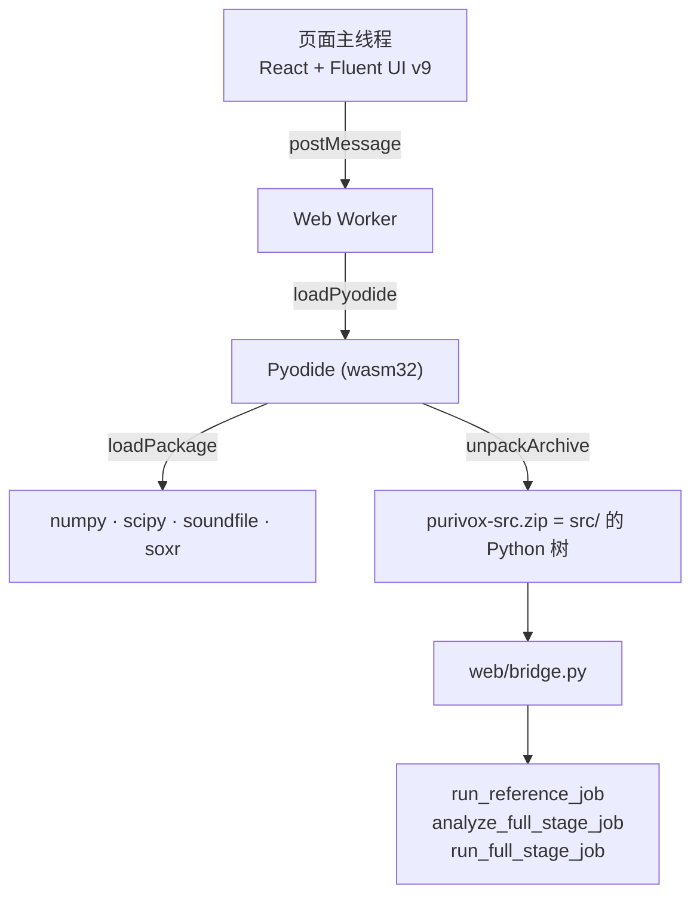

# 浏览器版（WebAssembly）

<p align="left">
  <strong>简体中文</strong> · <a href="en/web.md">English</a>
</p>

**线上地址：<https://purivox.wwchun.top/>**

浏览器版是 Purivox 的第三种外壳，和 GUI、CLI 并列。它把 `src/` 里同一份 Python 管线放进
[Pyodide](https://pyodide.org/) 运行，整站是纯静态资源，部署在 GitHub Pages 上，**没有后端**：
音频从头到尾留在用户自己的标签页里，不会上传到任何服务器。

## 覆盖范围

| 功能 | 浏览器版 | 原因 |
|---|---|---|
| 单曲垫音消除 | ✅ | `run_reference_job` 不含 Qt |
| 整场垫音消除（识别 + 时间线 + 渲染） | ✅ | `analyze_full_stage_job` / `run_full_stage_job` 不含 Qt |
| AI 音轨分离 | ❌ | `onnxruntime` 没有 WebAssembly 版的 Python 包 |

算法只有一份源码。浏览器跑的就是桌面版的 `src/features/**`，构建时打包进
`purivox-src.zip`，不存在第二套 TypeScript 实现。

## 结构



- `src/web/bridge.py`：面向 JavaScript 的作业入口，**JSON 进、JSON 出**。用 dict 会让 Pyodide
  交给页面一个需要手动 `destroy()` 的代理，而进度回调触发得足够频繁，每次泄漏一个代理就是问题。
- `src/web/timeline.py`：时间线的序列化。增删片段直接调用
  `features.full_stage.matching` 里的 `add_manual_clip` / `remove_manual_clip`，
  和 GUI 的 `TimelineModel` 走同一套规则。
- `src/web/limits.py`：内存预算估算，见下文。
- `web/`：Vite + React 前端，`bun run build` 的产物即可直接部署；按功能划分，与 Python 端同构。

## 前端分层

前端和 Python 端同构，按**功能**而不是按技术类型划分：

```text
web/src/
  main.tsx                       入口
  app/App.tsx                    外壳：导航、主题、运行时装配（对应 src/app/main_window.py）
  features/
    reference_removal/           MrPage.tsx、job.ts
    full_stage/                  FullStagePage.tsx、Timeline.tsx、clock.ts、job.ts
    settings/                    SettingsPage.tsx
  shared/                        不依赖 app 与 features
    runtime/                     PurivoxClient、worker 协议、useClient、useJob、types
    worker/                      Pyodide worker
    audio/                       解码回退与上传准备
    i18n/  ui/  jobs.ts  theme.ts
```

边界与 Python 端同一套，并且同样由检查强制而不是靠约定：
`scripts/check-architecture.mjs` 解析 import，要求 `shared` 不得导入 `app` 或 `features`、
功能之间不得互相导入、`app` 不得导入入口。它与 `tsc`、Biome 一起挂在 `bun run check` 上。

划分依据是看得见的：整场时间线的 `clock.ts` 带毫秒，因为时间范围要可编辑；
结果卡片的时长标签不带毫秒，住在 `shared/ui/duration.ts`。桌面端本来就是这样分的——
前者是 `full_stage/timeline_model.py` 的 `clock()`，后者是 `reference_removal/page.py`
的私有 `_clock()`。

## 为无 Qt、无线程环境所做的改动

浏览器路径上唯一的 Qt 硬依赖曾是 `shared/i18n.py`（被 `shared/progress.py` 顶层导入，
而每条管线都用 `report_progress`）。现在：

- `shared/i18n.py` 惰性导入 Qt，缺少 Qt 时 `tr()` 退化为返回 key 本身。
- `ProgressEvent` 带上了 `key` 和 `values`，进度以未翻译的 key 送到页面，
  由前端用同一套 `.ts` 词条渲染。`.ts` 仍是全部文案的唯一权威：桌面用
  `pyside6-lrelease` 编译成 `.qm`，浏览器用 `scripts/build-i18n.mjs` 生成 JSON。
- `process_audio` 增加了串行分支。Pyodide 编译的 CPython 没有 pthread，线程池起不来；
  分块的划分不变，只是逐块执行，结果与线程池路径逐位一致
  （`tests/features/reference_removal/test_dsp_execution.py`）。
- `create_pcm_audio` 与 `resample_audio` 在这里直接在堆上分配，不再经过临时文件和 `np.memmap`。
  Emscripten 的文件系统把内容存在 JavaScript 侧的数组里，`mmap` 没法把它别名到 wasm 堆上，
  只能另外分配一块再复制进去——一个映射缓冲区因此要占两份。实测一次三分钟的单曲任务：
  映射版本在 `/tmp` 里同时压着 190,512,000 字节，正好是三个全长缓冲，而两个版本的 wasm
  堆占用一模一样；改成堆上分配之后，那一份直接不存在了。
- `release_mapped_pages` 改为“尽力而为”。浏览器路径上已经没有映射可放；就算有，
  Emscripten 的 `msync` 也会报坏描述符而不是成功。
- `shared/dsp/spectral.py` 的 `stft` 直接按 hop 跨步取帧。原来先铺开每个偏移再隔 `hop` 取一行，
  中间视图高 `hop` 倍；numpy 会拒绝标称大小放不进一个指针的视图，而 wasm32 的指针是 32 位，
  44.1 kHz 下几秒音频就超了。两种写法结果完全相同。

## 页面上的取舍

### 加载状态不假装有进度

首次访问要下载约 23 MB（运行时 5.7 MB + numpy 2.8 + scipy 13.2 +
soundfile 0.7 + soxr 0.1，实测压缩后体积）。Pyodide 的 lock 文件里没有体积字段，
所以做不出真实的字节级进度条；页面显示的是四个启动阶段的粗进度，外加一句
“首次访问约需下载 23 MB，之后由浏览器缓存”。宁可说清楚要等多久，也不画一条编出来的进度条。
包是一次 `loadPackage` 并行下载的——串行能给出更细的进度，但会明显拖慢首屏，
用户等的是总时间。加载失败时给重试按钮，不必刷新页面。

### 上传是分块的，所以有进度

文件按 4 MiB 切片写进 Pyodide 的文件系统，
既保证任何时刻都不持有整个文件，也让一首普通长度的歌有六七格进度而不是一格。
第一片带上文件的最终大小，让运行时一次把空间开够：Emscripten 的追加写每次都要重新分配整块数组
并把已经写进去的内容复制过来，而且只按 1.125 倍增长，一个长录音会被反复搬运。实测 151 MB
的文件从 1.5 秒降到 0.5 秒。

### 快捷键在 app 层，不在页面上

`Ctrl+O` 选择文件、`Ctrl+Enter` 开始、`Esc` 取消、
`F5` 识别歌曲、`Ctrl+P` 试听播放 / 暂停，和桌面版一致。
理由也和桌面版相同：三个页面各自绑 `Ctrl+O` 会互相打架，
而窗口级快捷键在页面拿到焦点之前就能用。正在编辑时间范围时 `Esc` 和 `Enter` 归输入框，
不会误触发。

### 界面沿用桌面版已经想清楚的那套话术

首页、缺少输入时的具体提示
（“请先选择舞台 / 现场音频。”而不是只把按钮灰掉）、识别结果摘要、试听空状态、
开关的开 / 关文字，用的都是 `.ts` 里早就存在、web 端一直闲置的词条。
品牌图标也不是重画的：`scripts/build-assets.mjs` 把桌面版的
`src/resources/purivox.svg` 复制成站点的 favicon 和页眉标识，只有一份源。

### 选完文件就显示解码器读到了什么

`02:30 · 48.0 kHz · 立体声 · 27 MB`。`probe_audio` 一直返回这些，
之前没显示；采样率不对或文件被截断，现在在跑任务之前就看得见，
而且这几个数正是内存预算的计算依据。

### 试听是自建播放器，不是 `<audio controls>`

原生控件在 Fluent 界面里格格不入，
而且各浏览器长相不一。现在是播放 / 暂停、停止、可拖动的进度条、`00:15 / 00:20` 时间标签和音量，
文案用的是桌面版早就有的 `preview_play` / `preview_pause` / `preview_stop` / `preview_volume` /
`preview_error`。语义也照搬桌面版：播到结尾后再按播放会从头开始，`Ctrl+P` 切换播放 / 暂停。
按钮上直接写字（“播放”“停止”），没有 tooltip——桌面版就是
`preview_play.setText(...)`，而 Fluent 的 tooltip 每次键盘聚焦都会弹出并盖住卡片标题，
放在这种要反复点的控件上只会碍事。
进度条**不设 step**——Fluent 会为每个 step 画一个刻度，音频需要的精度会让上千个刻度把轨道整个盖掉，
而定位本来就该是连续的。同一时刻只有一个试听在播，开始一个会暂停另一个。

### 工作页面切走时只隐藏，不卸载

这修的是一个真 bug：之前切换标签会卸载页面，
正在播放的试听被打断，已完成的结果和正在跑的任务一起丢掉——用户换个标签并没有要求这些。
代价是三个页面同时挂载，所以快捷键的绑定要靠 `active` 判断谁在前台，否则后挂载的页面会抢走。

### 响应式按桌面版的断点走

620px 以下文件选择器把按钮堆到路径上方（对应桌面版的
`PORTRAIT`），标签栏和时间线表格各自横向滚动，页面本身在 375px 下不产生横向溢出。
键盘快捷键提示只在有精确指针的宽屏出现——触屏上没有 Ctrl 可按。

### 没有做代码分割

打包后 JS 是 560 KB（gzip 160 KB），相对 23 MB 的 Pyodide
不是瓶颈；把三个页面拆成异步块只会换来用户感觉不到的收益和一层额外的加载状态。

## 内存上限

wasm32 的堆上限是 4 GB，而 Emscripten 的文件系统住在同一个标签页的内存里——
桌面版靠 `np.memmap` 落盘省内存的策略在浏览器里没有落脚点，所以这里索性不映射（见上一节）。
`create_pcm_audio` 的每一次分配都是常驻内存，上传的文件也是。

`src/web/limits.py` 用下面的式子估算峰值，`WASM_BUDGET_BYTES` 取 2.6 GB
（4 GB 减去解释器、numpy/scipy 与内存碎片的余量）：

```text
单曲：  输入字节 + 歌曲缓冲 + 参考缓冲 + max(两者) + DSP 工作集
整场：  输入字节 + 2 × 舞台缓冲 + 3 × 最长音源缓冲 + DSP 工作集
其中：  缓冲字节 = 声道数(2) × 采样率 × 4 × 秒数
```

超出预算的任务会被直接拒绝并提示改用桌面版，到 60% 时给出警告。
44.1 kHz 立体声下这大致对应整场约 60 分钟、单曲约 30 分钟；
公式按实际采样率计算，48 kHz / 96 kHz 素材会自动收紧。

识别阶段不受此限：`analyze_full_stage` 读完舞台录音就 `cleanup()`，只保留降采样代理。
真正吃内存的是渲染，它要同时持有舞台和输出两个全长缓冲。

## 取消

取消的做法是**终止 Worker 再重建运行时**。Pyodide 在 Worker 唯一的线程上同步跑管线，
忙碌中的 Python 收不到消息；桌面版那种协作式 `CancellationToken` 需要 `SharedArrayBuffer`，
而 GitHub Pages 无法发送启用它所需的 COOP/COEP 响应头。

终止会连同 Emscripten 的文件系统一起消失，所以 `PurivoxClient` 记着自己上传过哪些 `File`
并在重建后原路写回——`File` 只是浏览器对本地文件的引用，留着不占内存，
用户不必在每次取消后重新选一遍音频。

## 解码

`soundfile` 带的 libsndfile 编译进了 FLAC、Ogg/Vorbis、Opus 和 MP3，
所以浏览器能读的容器和桌面版基本一致。libsndfile 读不了的（主要是 MP4 里的 AAC），
`probe_audio` 会如实报告而不是抛错，页面改用浏览器自己的 `decodeAudioData` 解码后
以 WAV 交给管线——和桌面版 libsndfile → Qt Multimedia 的两级回退是同一个安排。

## 本地运行与部署

```bash
cd web
bun install
bun run dev
```

`predev` / `prebuild` 会先打包 `src/` 并生成翻译 JSON，所以改完 Python 或 `.ts` 词条后
重新跑一次即可。检查与格式化：

```bash
cd web && bun run lint      # Biome（recommended 规则）
cd web && bun run format    # biome check --write
cd web && bun run check     # lint + tsc + 分层检查，build 会先跑它
```

构建：

```bash
cd web && bun run build
```

产物在 `web/dist/`。Vite 的 `base` 默认是 `/`，因为站点部署在自定义域名
（<https://purivox.wwchun.top/>）的根路径上。
若要发布成 GitHub Pages 的项目站点（`用户名.github.io/仓库名/`），
用 `PURIVOX_BASE=/仓库名/ bun run build` 覆盖，否则子路径下的资源会 404。
CI 在 `.github/workflows/common.yml` 的 `web` 作业里构建，并在 `main` 上发布到 Pages。

Pyodide 运行时从 jsDelivr 加载，版本固定在 `PYODIDE_URL`
（`web/src/runtime/PurivoxClient.ts`），不进仓库——单是 scipy 就有几十 MB，
不该由 Pages 的仓库体积和带宽来扛。

## 与桌面版的结果一致性

同一对输入、同样的参数下，浏览器输出与 `purivox mr` 的输出在 16 位量化上最多差 1 个最低位，
RMS 差约 −108 dB，即浮点舍入噪声，不是算法差异。

需要注意的是：`_processing_workers` 用 `os.cpu_count()` 决定分块大小，
所以桌面版本身在不同核心数的机器上结果就略有不同，浏览器（单核）属于同一类差异。
